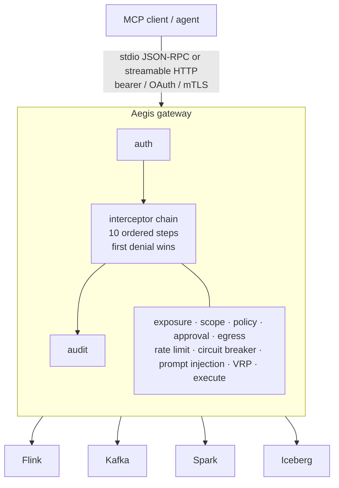

# Aegis MCP Governance Gateway

Aegis is a vendor-neutral, secure-by-default Model Context Protocol (MCP) governance gateway for
data and streaming engines. It puts a single, auditable control plane in front of many backend
engines so that an LLM agent never talks to Flink, Kafka, Spark or Iceberg directly.

The gateway owns identity, authorization, approvals, egress control, rate limiting, circuit
breaking, output redaction and audit. Engines plug in through a small service provider interface
(SPI) and contribute only tool definitions plus backend calls.

## Why a gateway

- One governance chain instead of one bespoke policy layer per engine.
- Read-only by default. Mutating and destructive tools stay unregistered until writes are unlocked
  and an approval token is presented.
- A stable deny taxonomy so operators can alert on `POLICY_DENIED` or `APPROVAL_REQUIRED` across
  every engine with one rule.
- Tool catalog integrity so a compromised or swapped adapter cannot silently change what an agent
  is allowed to call (rug-pull defense).

## Modules

| Module | Purpose |
| --- | --- |
| `mcp-gateway-core` | SPI, governance interceptor chain, auth, config, transports, bootstrap |
| `mcp-adapter-flink` | Apache Flink REST and SQL Gateway (reference) |
| `mcp-adapter-kafka` | Apache Kafka AdminClient + Schema Registry |
| `mcp-adapter-spark` | Apache Spark History + Livy |
| `mcp-adapter-iceberg` | Apache Iceberg REST catalog |
| `mcp-adapter-*` | Additional Apache data-platform adapters (Pulsar, NiFi, Hive, Hudi, Pinot, Druid, Airflow, Hadoop, HBase, Cassandra, Solr, Ranger, Atlas, and more) |
| `mcp-gateway-dist` | Shaded runnable distribution bundling every adapter |

Only `mcp-gateway-core` is required. Adapters are discovered at runtime and restricted with
`MCP_GW_ADAPTERS` (recommended: enable only the engines you operate). See
[docs/adapters.md](docs/adapters.md) for the full catalog.

## Architecture at a glance



Every tool call passes the same chain. The first denial wins and returns a stable code. See
[docs/LLD-apache-mcp-gateway.md](docs/LLD-apache-mcp-gateway.md) for the full step table.

## Secure by default

- `MCP_GW_WRITE_ENABLED=false` by default, so only `READ` class tools are registered.
- Unlocking writes additionally requires `MCP_GW_APPROVAL_SECRET`; otherwise startup fails closed.
- HTTP transport requires an inbound credential (`MCP_GW_HTTP_BEARER_TOKEN`,
  `MCP_GW_AUTH_TOKENS_FILE`, or an OAuth resource server configuration).
- Outbound calls are checked against an egress allow list that always denies cloud metadata
  endpoints such as `169.254.169.254`.
- Tool output is size bounded and passed through data loss prevention redaction before it reaches
  the model.
- stdout is reserved for MCP JSON-RPC frames. All logging goes to stderr through SLF4J and Logback.

## Build

```bash
mvn -q clean install
```

Build only the core module:

```bash
mvn -q -f mcp-gateway-core/pom.xml clean test
```

Requirements: JDK 17 or newer and Maven 3.9 or newer.

## Run

### stdio (default, local agent)

```bash
export MCP_GW_TRANSPORT=stdio
export MCP_GW_ADAPTERS=flink
java -jar mcp-gateway-dist/target/aegis-mcp-gateway-0.1.0-all.jar
```

### Streamable HTTP

```bash
export MCP_GW_TRANSPORT=http
export MCP_GW_HTTP_HOST=127.0.0.1
export MCP_GW_HTTP_PORT=8090
export MCP_GW_AUTH_MODE=tokenfile
export MCP_GW_AUTH_TOKENS_FILE=/etc/aegis/auth-tokens.txt
export MCP_GW_HTTP_TLS_ENABLED=true
export MCP_GW_HTTP_TLS_KEYSTORE=/etc/aegis/server.p12
export MCP_GW_HTTP_TLS_KEYSTORE_PASSWORD='<keystore-password>'
java -jar mcp-gateway-dist/target/aegis-mcp-gateway-0.1.0-all.jar
```

The MCP endpoint is `POST /mcp`. Operational endpoints are `/healthz`, `/readyz` and `/metrics`
(Prometheus text format).

### Unlocking writes

```bash
export MCP_GW_WRITE_ENABLED=true
export MCP_GW_APPROVAL_SECRET="$(openssl rand -hex 32)"
```

Mint a short-lived approval token for a single mutating call:

```bash
java -cp mcp-gateway-core/target/classes \
  io.github.vaquarkhan.aegis.core.governance.Approval "$MCP_GW_APPROVAL_SECRET" cancel_job job-42 300
```

Pass the printed value as the `approvalToken` argument. Tokens are single use, scope bound and
expire after `MCP_GW_APPROVAL_TTL_MS`.

## Configuration

All runtime settings come from the environment (twelve-factor). `MCP_GW_CONFIG` optionally points
at a `gateway.yaml` file whose values are used as defaults before environment overrides are
applied. The complete key list lives in
[docs/LLD-apache-mcp-gateway.md](docs/LLD-apache-mcp-gateway.md).

## Documentation

- [docs/getting-started.md](docs/getting-started.md) - build and first run
- [docs/operations.md](docs/operations.md) - auth, TLS, writes, HA limits
- [docs/adapters.md](docs/adapters.md) - Flink, Kafka, Spark, Iceberg
- [docs/DESIGN-apache-mcp-gateway.md](docs/DESIGN-apache-mcp-gateway.md) - architecture and design rationale
- [docs/LLD-apache-mcp-gateway.md](docs/LLD-apache-mcp-gateway.md) - low level design, deny codes, config keys
- [docs/RESEARCH-centralized-mcp-gateway.md](docs/RESEARCH-centralized-mcp-gateway.md) - strategic analysis and standards mapping
- [docs/CURSOR-BUILD-INSTRUCTIONS.md](docs/CURSOR-BUILD-INSTRUCTIONS.md) - scaffolding and build instructions
- [examples/](examples/) - stdio, HTTP, approvals, multi-adapter, Cursor, Compose
- [CHANGELOG.md](CHANGELOG.md) · [SECURITY.md](SECURITY.md) · [CONTRIBUTING.md](CONTRIBUTING.md) · [ROADMAP.md](ROADMAP.md)

## License

Apache License, Version 2.0. See [LICENSE](LICENSE) and [NOTICE](NOTICE).

Author: Viquar Khan
