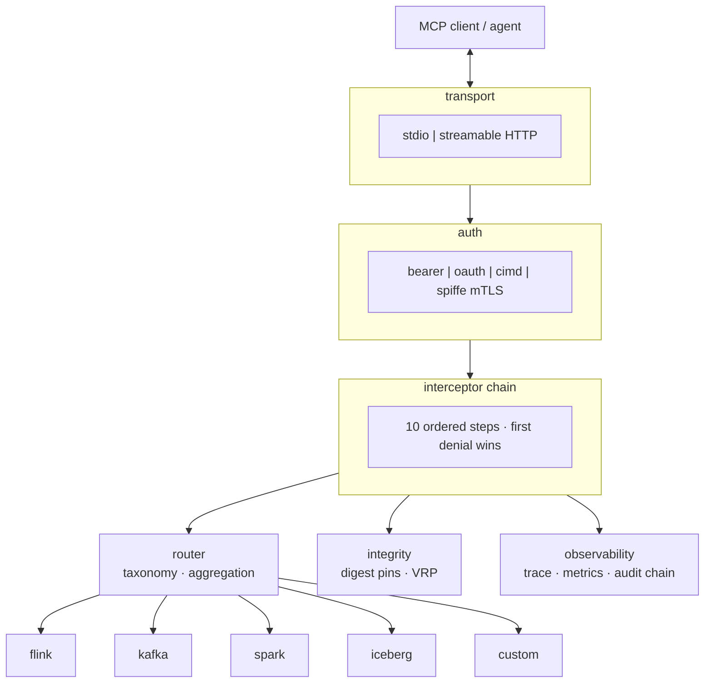

# Aegis MCP Governance Gateway - Design

Author: Viquar Khan
Status: draft for 0.1.0
License: Apache License, Version 2.0

## 1. Problem statement

Agentic clients want to operate real data infrastructure: list Flink jobs, describe Kafka topics,
inspect Spark applications, expire Iceberg snapshots. Wiring one MCP server per engine produces
one bespoke security model per engine. Each server re-implements authentication, allow lists,
approvals, redaction and audit, usually inconsistently, and each new engine multiplies the review
surface.

Aegis inverts that. There is one governed gateway process. Engines contribute tools through a
narrow SPI and contribute no policy. Governance is implemented once, tested once, and applies
uniformly.

## 2. Goals and non-goals

### Goals

- One ordered, deterministic governance chain for every tool call regardless of engine.
- Read-only by default. Writes require an explicit unlock plus a per-call approval token.
- Stable, machine-readable deny codes so operators can alert across engines with one rule.
- Pluggable engine adapters discovered at runtime, configurable through YAML manifests.
- Tool catalog integrity to defend against rug-pull and tool poisoning.
- stdout reserved for MCP JSON-RPC. Logs go to stderr only.

### Non-goals

- Aegis is not a query engine, scheduler or catalog. It proxies and governs.
- Aegis does not attempt semantic understanding of arbitrary backend payloads beyond bounded
  redaction and read-only statement guards.
- Aegis does not replace the backend's own authorization. It composes with it (defense in depth).

## 3. Architecture



### Process layout

A single JVM. `GatewayBootstrap` loads `GatewayConfig`, discovers adapters through
`AdapterRegistry`, aggregates tool manifests through `ToolManifestAggregator`, registers the
surviving tools with the MCP SDK server, and starts either the stdio transport or embedded Jetty.

### Layering

| Layer | Package | Responsibility |
| --- | --- | --- |
| SPI | `spi` | Contracts adapters implement. No governance logic. |
| Auth | `auth` | Who is calling. Identity resolution and inbound credentials. |
| Authz | `authz` | Whether this caller may call this tool. Policy decision point. |
| Governance | `governance` | Exposure, scope, approval, rate, breaker, egress, output. |
| Interceptor | `interceptor` | Ordering and composition of the above. |
| Integrity | `integrity` | Catalog digests, rug-pull detection, validate-run-promote. |
| Router | `router` | Manifest aggregation and taxonomy based routing. |
| Observability | `observability` | Trace ids, metrics, hash-chained audit. |
| FinOps | `finops` | Token budgets and semantic caching. |
| Config | `config` | Environment and YAML configuration, adapter registry. |
| Transport | `transport` | stdio, streamable HTTP, TLS, ops endpoints. |
| Boot | `boot` | Wiring. |

Dependencies point downward only. Adapters depend on `spi` and `util`, never on `interceptor`
or `governance`.

### Proxy, router, and gateway

Mediation nodes are not all equal. Aegis is intentionally a **gateway**, not a blind proxy.

| Tier | What it does | Aegis |
| --- | --- | --- |
| Proxy (L4) | Forward bytes without understanding MCP | Out of scope |
| Router (L7 capability) | Dispatch by tool or taxonomy | `TaxonomyRouter`, adapter aggregation |
| Gateway (L7 policy) | Identity, approval, quotas, redaction, audit | `InterceptorChain` and surrounding packages |

A router alone solves M x N discovery. A gateway is the trust boundary: one deny taxonomy, one
audit chain, one write unlock, many engines. See
[RESEARCH-centralized-mcp-gateway.md](RESEARCH-centralized-mcp-gateway.md) for the longer
strategic analysis and standards mapping.

## 4. Service provider interface

An adapter is a plain Java object that answers five questions: what engine am I, what taxonomy
class do I belong to, what tools do I offer, what resources do I offer, and which hosts must the
gateway be allowed to reach on my behalf.

```java
public interface EngineAdapter {
    String engineId();
    String taxonomyClass();
    List<ToolDef> tools(GatewayConfig cfg);
    List<ResourceDef> resources(GatewayConfig cfg);
    default Optional<ReadOnlyGuard> readOnlyGuard() { return Optional.empty(); }
    default Optional<CredentialResolver> credentialResolver() { return Optional.empty(); }
    Set<String> egressAllowHosts(GatewayConfig cfg);
}
```

Supporting types:

- `ToolClass` is `READ`, `MUTATE` or `DESTRUCTIVE`. It is the single input that drives write
  gating, approval requirements and validate-run-promote.
- `ToolDef` carries the tool name, class, description, JSON Schema string and a backend function
  `Function<CallContext, String>`. The backend returns a string body; the gateway bounds and
  redacts it.
- `ResourceDef` carries an MCP resource URI, name, MIME type, read function and a redact flag.
- `ReadOnlyGuard` lets an engine assert that a statement is read-only, used for SQL style tools.
- `CredentialResolver` performs on-behalf-of credential exchange so the gateway can present a
  caller-specific outbound credential instead of a shared service account.
- `CallContext` is the immutable per-call carrier: tool name, class, arguments, caller identity,
  trace id and the resolved outbound credential.

Design rule: the SPI never exposes MCP SDK types. Adapters return plain data, so adapters compile
without the SDK and can be unit tested without a server.

## 5. Interceptor order

The chain is fixed and ordered. Order is a security property, not an implementation detail:
cheap authorization checks run before expensive ones, and no backend call happens until every
gate has passed.

| Step | Interceptor | Deny code |
| --- | --- | --- |
| 1 | Exposure | `NOT_EXPOSED` |
| 2 | Read-only caller and scope | `READONLY_CALLER`, `SCOPE_DENIED` |
| 3 | Policy decision point | `POLICY_DENIED` |
| 4 | Approval token | `APPROVAL_REQUIRED` |
| 5 | Egress guard | `EGRESS_DENIED` |
| 6 | Rate limiter | `RATE_LIMITED` |
| 7 | Circuit breaker | `BREAKER_OPEN` |
| 8 | Prompt injection guard | `PROMPT_INJECTION` |
| 9 | Validate-run-promote | `VRP_FAILED` |
| 10 | Execute with timeout | `INVALID_INPUT`, `TIMEOUT`, `BACKEND_ERROR` |

First denial wins. The chain returns immediately and never reaches the backend.

Outbound, after a successful execute, the result passes through output bounding and then
redaction, in that order, so that a truncated payload cannot leave a partial secret unredacted at
the truncation boundary.

Observers (trace, metrics, audit) run on every outcome, allow or deny. They cannot change the
decision.

Failure accounting: `TIMEOUT` and `BACKEND_ERROR` trip the circuit breaker because they indicate
backend trouble. `INVALID_INPUT` does not, because a malformed argument is the caller's fault and
must not let one client open the breaker for everyone.

## 6. YAML driven manifests

Two documents drive runtime shape.

`gateway.yaml` sets transport, auth, governance limits and the enabled adapter list. It is loaded
when `MCP_GW_CONFIG` points at it. Environment variables always win over YAML, so containers can
ship a baseline file and override per deployment.

`tools.yaml` is a catalog overlay. It can rename a tool, change its description, force a lower
tool class, pin an expected schema digest, or drop a tool entirely. It cannot raise a tool's
class or invent a backend, so the overlay can only ever reduce authority.

This split keeps the sensitive decisions (what is exposed, what may mutate) in declarative,
reviewable, diffable files rather than in code.

## 7. Secure by default

- Writes are locked. `MCP_GW_WRITE_ENABLED=false` means `MUTATE` and `DESTRUCTIVE` tools are never
  registered, so they do not even appear in `tools/list`.
- Unlocking writes without `MCP_GW_APPROVAL_SECRET` is a startup error, not a warning.
- HTTP transport without an inbound credential is a startup error.
- Approval tokens are HMAC-SHA256, scope bound, time bound and single use through a nonce store.
- Egress is deny-by-default when an allow list is configured, and cloud metadata addresses are
  denied unconditionally.
- Output is bounded by `MCP_GW_MAX_BYTES` and redacted for keys, tokens, bearer headers, private
  key blocks and email addresses.
- Audit entries are hash chained, so tampering with history is detectable.
- Tool catalog digests are computed at registration. A changed digest for a previously seen tool
  is reported as a rug-pull signal.

## 8. Adapters

Each adapter module is independent and optional.

| Adapter | Taxonomy class | Representative read tools | Representative write tools |
| --- | --- | --- | --- |
| Flink | `streaming` | `list_jobs`, `get_job`, `get_job_exceptions`, `run_sql_readonly` | `trigger_savepoint`, `rescale_job`, `stop_job`, `cancel_job` |
| Kafka | `messaging` | `list_topics`, `describe_topic`, `query_schema_registry`, `inspect_dlq` | `create_topic`, `alter_config`, `reset_offsets`, `delete_records` |
| Spark | `batch` | `list_applications`, `get_application`, `run_sql_readonly` | `submit_batch`, `kill_application` |
| Iceberg | `lakehouse` | `list_namespaces`, `list_tables`, `get_table_metadata`, `dry_run_maintenance` | `create_namespace`, `alter_table`, `expire_snapshots`, `remove_orphan_files`, `rewrite_data_files`, `commit_transaction`, `drop_table` |
| Pulsar, ActiveMQ | `messaging` | cluster / topic / queue reads | create / delete / purge |
| NiFi, Beam, Storm, Flume | `dataflow` / `pipeline` / `streaming` / `ingest` | status and inventory | start / stop / cancel |
| Hudi, Paimon | `lakehouse` | list / get tables | clustering / compaction / drop |
| Hive, Calcite, Impala | `query` | status / SQL readonly | kill query |
| Pinot, Druid, Doris | `olap` | tables / datasources / SQL | delete / disable |
| Hadoop, Ozone | `storage` / `objectstore` | list / status | mkdir / delete |
| HBase, Cassandra, Kudu, Ignite, CouchDB | `datastore` | list / get | drop / destroy |
| BookKeeper | `logstore` | bookie / ledger list | delete ledger |
| Airflow | `orchestration` | health / DAGs | trigger / delete DAG |
| ZooKeeper | `coordination` | ruok / children | delete znode |
| Solr | `search` | collections / query | delete collection |
| Superset | `bi` | databases / charts | delete chart |
| Arrow Flight | `analytics` | list flights | do_action |
| Ranger, Atlas | `governance` / `metadata` | services / policies / entities | delete |

Full env keys and maturity notes: [adapters.md](adapters.md).

Per-adapter runnable examples: [../examples/adapters](../examples/adapters).

Adapters supply `egressAllowHosts` so the gateway can compute the union allow list. An adapter
that returns an empty set contributes nothing and its outbound calls are denied unless the
operator adds hosts through `MCP_GW_EGRESS_ALLOW_HOSTS`.

Iceberg style maintenance is the motivating case for validate-run-promote: `expire_snapshots` must
first be run as a dry run that reports what would be removed, and the destructive run must
reference that dry-run receipt.

## 9. Threat model summary

| Threat | Control |
| --- | --- |
| Prompt injection steering the agent into a destructive call | Write lock, approval tokens, prompt injection guard, class based gating |
| Tool poisoning or rug-pull after install | `ToolCatalogIntegrity` digests and `DigestRegistry` pins |
| Confused deputy against cloud metadata | `EgressGuard` unconditional metadata deny |
| Credential leakage into model context | `OutputControls` redaction, credential resolver keeps secrets server side |
| Runaway cost | `TokenBudget`, `SemanticCache`, rate limiter |
| Backend brownout amplified by retries | Circuit breaker plus bounded timeout executor |
| Audit repudiation | Hash-chained `AuditLog` with verifiable chain |

## 10. Open items for later releases

- OAuth resource server validation with JWKS is implemented in 0.1.0 when
  `MCP_GW_OAUTH_JWKS_URL` is set; without JWKS the filter stays fail-closed. See LLD section 8.
- CIMD (client identity metadata document) verification is a stub.
- SPIFFE mTLS peer verification is a stub that currently only reports whether it is configured.
- `SemanticCache` is an in-memory map. A shared cache is out of scope for 0.1.0.
- Streamable HTTP intermediary headers (`Mcp-Method`, `Mcp-Name`, protocol version) for LB/WAF
  routing without body parse (MCP 2026-07-28 direction).
- Protocol-level interceptor discovery (`interceptors/list`) only after SEP-2624 or its
  successor is accepted; Aegis keeps a gateway-local chain today (inspired by SEP-1763).
- Externalized rate, nonce, and audit stores for multi-replica HA (LLD section 18).
- OpenTelemetry span export alongside Prometheus metrics.

## 11. Related documents

- [LLD-apache-mcp-gateway.md](LLD-apache-mcp-gateway.md) - diagrams plus implementation notes
- [RESEARCH-centralized-mcp-gateway.md](RESEARCH-centralized-mcp-gateway.md) - strategic analysis,
  MCP/Kafka standards mapping, Bastion compose notes, roadmap implications
- [CURSOR-BUILD-INSTRUCTIONS.md](CURSOR-BUILD-INSTRUCTIONS.md) - scaffolding rules for agents
