# Aegis MCP Governance Gateway - End to End Design

Author: Vaquar Khan
Status: draft for 0.1.0
License: Apache License, Version 2.0

This single document carries the full design: requirements, high level design, and low
level design. It is written so a reviewer can read one file and understand what the system
must do, how it is shaped, and how it works at the class and call level. It has no em
dashes. Mermaid diagrams are included and mirror the reference implementation.

Contents:
- Part A. Requirements
- Part B. High level design
- Part C. Low level design

----------------------------------------------------------------------

# Part A. Requirements

## A1. Problem statement

Agentic clients want to operate real data infrastructure: list Flink jobs, describe Kafka
topics, inspect Spark applications, expire Iceberg snapshots. An MCP server that can reach
an engine control plane is a privileged client. Shipping one safely means shipping an
access control product: authentication, authorization, approval for destructive actions,
redaction of secrets, rate and cost limits, and forensic audit.

Today teams wire one MCP server per engine. Each re-implements that security model
separately, usually inconsistently, and many skip it and stay read only. Every new engine
multiplies the review surface, and most of these servers are single maintainer projects
with no shared audit and no common policy. There is no neutral standard for how an agent
operates Apache data systems safely.

Aegis inverts this. There is one governed gateway process. Engines contribute tools
through a narrow service provider interface and contribute no policy. Governance is
implemented once, tested once, and applied uniformly to every call.

## A2. Personas

- Autonomous agent or LLM application. Calls tools to read and, when unlocked and approved,
  to change engine state.
- Human operator or SRE. Uses the same governed endpoint, often to mint approvals or run
  incident triage.
- Platform owner. Configures which engines are exposed, which callers exist, and the
  governance limits.
- Security and audit reviewer. Consumes the tamper evident audit trail and the deny
  taxonomy.

## A3. Functional requirements

FR1. Single governed MCP endpoint. All agent traffic passes one endpoint over stdio or
Streamable HTTP. The agent never talks to an engine directly.

FR2. Engine adapter SPI. An engine plugs in by implementing a narrow interface that
answers: engine id, taxonomy class, tools, resources, optional read only guard, optional
credential resolver, and the outbound hosts the gateway may reach. Adapters contribute no
policy and never see MCP SDK types.

FR3. Tool classification. Every tool declares a class of READ, MUTATE, or DESTRUCTIVE.
This single value drives write gating, approval, and integrity checks.

FR4. Read only by default. With writes locked, only READ tools are registered, so MUTATE
and DESTRUCTIVE tools do not even appear in tools/list.

FR5. Explicit write unlock. Enabling writes requires an explicit switch plus an approval
signing secret. Enabling writes without the secret is a startup failure, not a warning.

FR6. Per call approval for destructive actions. A MUTATE or DESTRUCTIVE call requires an
approval token that is HMAC signed, time bounded, single use, and bound to one tool and
one scope.

FR7. Identity and per caller scope. Each caller resolves to an identity with scopes and
allow lists (for example which jobs, jars, or namespaces it may touch) and a read only
flag. The HTTP transport requires an inbound credential.

FR8. Policy decision point. A pluggable authorization decision runs on every call. A
builtin engine ships; external Cedar and OPA engines are selectable.

FR9. Egress and server side request forgery defense. Outbound targets are checked against
an allow list, and cloud metadata and non routable address space are denied
unconditionally, including numeric IP encodings and names that resolve to denied
addresses.

FR10. Rate limiting per caller. A per caller budget prevents one noisy agent from
consuming the ceiling shared by everyone.

FR11. Circuit breaking per tool. Repeated backend failures open a per tool breaker to
protect the backend.

FR12. Prompt injection screening. Inbound arguments are screened for adversarial payloads.

FR13. Output bounding and redaction. Tool output is size bounded and passed through
redaction of secrets before it reaches the model.

FR14. Tamper evident audit. Every outcome, allow or deny, is written to a hash chained
audit log whose integrity can be verified.

FR15. Tool catalog integrity. Tool schemas are digested at registration so a swapped or
poisoned adapter that changes what an agent may call is detectable (rug pull defense).

FR16. Taxonomy aware tool listing. tools/list can be pruned by intent against engine
taxonomy classes, and the pruned set is never wider than what the caller is authorized
for.

FR17. Multiple transports. stdio for local agents and authenticated Streamable HTTP with
TLS for networked deployments. stdout is reserved for MCP frames; logs go to stderr.

FR18. Multiple auth modes. Bearer token file, OAuth 2.1 resource server with JWKS, and, on
the roadmap, CIMD and SPIFFE mTLS.

FR19. Operational endpoints. Health, readiness, and Prometheus metrics endpoints.

FR20. Configuration. All runtime settings come from the environment, with an optional YAML
file for defaults. A catalog overlay can rename, describe, lower a tool class, pin a
schema digest, or drop a tool, but can never raise authority.

## A4. Non functional requirements

NFR1. Security first and fail closed. Any missing, malformed, or misconfigured input
results in denial. Secrets are compared in constant time. Startup validation refuses unsafe
configurations.

NFR2. Deterministic governance. One ordered chain, first denial wins, with a stable machine
readable deny code for every outcome so operators alert across engines with one rule.

NFR3. Low and predictable latency. The gateway is on the hot path of every tool call, so
governance overhead must be small and bounded.

NFR4. Horizontal scalability. The protocol edge is stateless so replicas run behind a plain
load balancer with no sticky sessions. Shared governance state can be externalized for high
availability.

NFR5. Maintainability. Adding an engine is a small adapter, not a new security model. There
is one chain to review and harden, so the security review surface stays flat as engines are
added.

NFR6. Observability. Trace id propagation, metrics, and a verifiable audit chain on every
call.

NFR7. Portability. JVM 17 or newer, built with Maven, no dependency on any engine core.

NFR8. Reliability. Bounded per adapter execution pools and per tool timeouts so one slow
backend cannot exhaust the gateway.

## A5. Constraints and assumptions

- The gateway composes with, and does not replace, each backend own authorization. It is
  defense in depth.
- It is not a query engine, scheduler, or catalog. It proxies and governs.
- Backend session state (a SQL gateway session, a Livy session, an Iceberg transaction) is
  opened, used, and closed within a single tool call.
- Runtime dependencies are Apache 2.0 or compatible; no GPL or category X dependency in the
  core.

## A6. Out of scope for 0.1.0

- Agent to agent (A2A) delegation on the north side.
- A shared distributed cache; the semantic cache is in process.
- Full verifiable reconciliation proof; the integrity gate ships as a dry run receipt.

----------------------------------------------------------------------

# Part B. High level design

## B1. Goals and non goals

Goals: one ordered deterministic governance chain for every tool call regardless of engine;
read only by default with explicit unlock plus per call approval; stable machine readable
deny codes; pluggable adapters discovered at runtime; tool catalog integrity against rug
pull and tool poisoning; stdout reserved for MCP frames.

Non goals: Aegis is not a query engine, scheduler, or catalog; it does not attempt semantic
understanding of arbitrary backend payloads beyond bounded redaction and read only guards;
it does not replace the backend own authorization.

## B2. Architecture

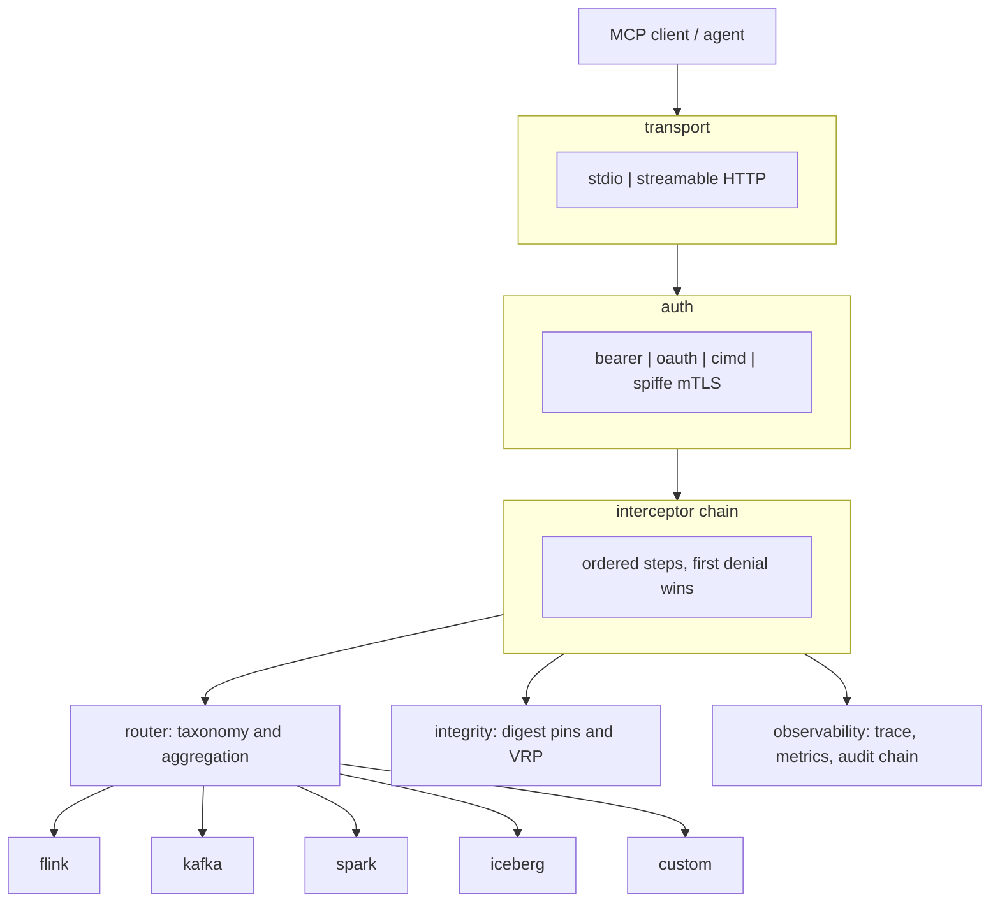

Explanation. This is the top to bottom path of a request. There is one door in (the client
to a single transport), the request is turned into an identity by auth before anything else,
and only an identified request reaches the interceptor chain. The chain is the center: it
consults the router for listing and taxonomy, the integrity component for digest pins, and
emits to observability on every outcome. The router then dispatches an allowed call to the
right adapter, which reaches Flink, Kafka, Spark, Iceberg, or a custom engine. An engine is
never reached except through the chain. See D1 for the deeper walkthrough.

## B3. Process layout

A single JVM. Bootstrap loads configuration, discovers adapters through a registry,
aggregates tool manifests, registers the surviving tools with the MCP server, and starts
either the stdio transport or embedded HTTP.

## B4. Layering

| Layer | Package | Responsibility |
| --- | --- | --- |
| SPI | spi | Contracts adapters implement. No governance logic. |
| Auth | auth | Who is calling. Identity resolution and inbound credentials. |
| Authz | authz | Whether this caller may call this tool. Policy decision point. |
| Governance | governance | Exposure, scope, approval, rate, breaker, egress, output. |
| Interceptor | interceptor | Ordering and composition of the above. |
| Integrity | integrity | Catalog digests, rug pull detection, validate run promote. |
| Router | router | Manifest aggregation and taxonomy based routing. |
| Observability | observability | Trace ids, metrics, hash chained audit. |
| FinOps | finops | Token budgets and semantic caching. |
| Config | config | Environment and YAML configuration, adapter registry. |
| Transport | transport | stdio, streamable HTTP, TLS, ops endpoints. |
| Boot | boot | Wiring. |

Dependencies point downward only. Adapters depend on spi and util, never on interceptor or
governance.

## B5. Proxy, router, gateway

Aegis is intentionally a gateway, not a blind proxy. A proxy forwards bytes. A router
dispatches by capability but does not know the caller. A gateway is a trust boundary: it
knows the tool, the principal, the budget, and the policy for every call, and it can deny,
redact, gate, and record. One deny taxonomy, one audit chain, one write unlock, many
engines.

## B6. Interceptor chain (the heart of the design)

The chain is fixed and ordered. Order is a security property: cheap authorization checks
run before expensive ones, and no backend call happens until every gate passes.

| Step | Interceptor | Deny code |
| --- | --- | --- |
| 1 | Exposure | NOT_EXPOSED |
| 2 | Read only caller and scope | READONLY_CALLER, SCOPE_DENIED |
| 3 | Policy decision point | POLICY_DENIED |
| 4 | Approval token | APPROVAL_REQUIRED |
| 5 | Egress guard | EGRESS_DENIED |
| 6 | Rate limiter | RATE_LIMITED |
| 7 | Circuit breaker | BREAKER_OPEN |
| 8 | Prompt injection guard | PROMPT_INJECTION |
| 9 | Validate run promote | VRP_FAILED |
| 10 | Execute with timeout | INVALID_INPUT, TIMEOUT, BACKEND_ERROR |

First denial wins and returns immediately. Outbound, after a successful execute, the result
passes through output bounding and then redaction, so a truncated payload cannot leave a
partial secret unredacted at the boundary. Observers (trace, metrics, audit) run on every
outcome and cannot change the decision. TIMEOUT and BACKEND_ERROR trip the breaker;
INVALID_INPUT does not, because a malformed argument is the caller fault and must not open
the breaker for everyone.

## B7. Secure by default

- Writes are locked; MUTATE and DESTRUCTIVE tools are not even registered.
- Unlocking writes without an approval secret is a startup error.
- HTTP transport without an inbound credential is a startup error.
- Approval tokens are HMAC-SHA256, scope bound, time bound, single use.
- Egress is deny by default when an allow list is set; metadata addresses are always denied.
- Output is bounded and redacted.
- Audit entries are hash chained so tampering is detectable.
- Tool catalog digests are computed at registration; a changed digest is a rug pull signal.

## B8. Architecture decision records (summary)

ADR-1 to ADR-10 (from the design): one interceptor chain; read only by default with
explicit unlock; per call approval tokens; per caller identity and scope; pluggable PDP;
egress and SSRF defense; output bounding and redaction; tamper evident audit; tool catalog
integrity; YAML driven manifests and catalog overlay.

ADR-11 Language. Java on the JVM (target 17 or newer) for the core and reference adapters,
because the engine clients are JVM native, the validated Flink server is reusable, MCP Java
performance is strong, and the security primitives are reviewable. The wire contract and
the adapter SPI are language neutral (String in, String out), so non JVM adapters and
optional Python sidecars for machine learning controls can join behind the same contract.

ADR-12 State. Stateless at the protocol edge. Governance state is in process for a single
instance and externalized to a shared store for high availability so replay protection,
counters, and budgets are correct across replicas. Backend sessions are short lived and
encapsulated per call inside adapters. The audit chain is durable and verifiable. Long
running jobs use an asynchronous submit then poll model rather than holding the request
thread.

ADR-13 A2A. MCP first. The gateway is an MCP server and ships without A2A. A2A is an
optional later north side facade that reuses the same governance chain, added only when
multi agent delegation is a real requirement.

## B9. Deployment topology

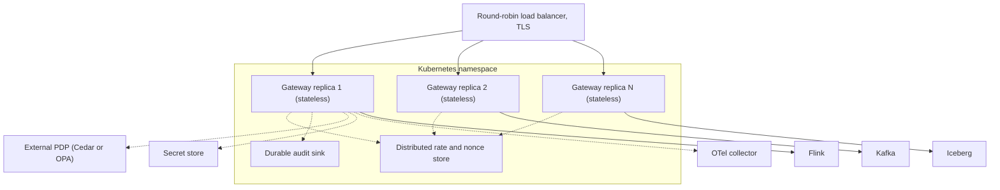

Explanation. A plain round robin load balancer with TLS spreads traffic across identical
gateway replicas with no sticky sessions, which is possible because the protocol edge is
stateless. The dotted arrows to the shared rate and nonce store are the key detail:
approval nonces and rate counters must be shared, or a replay could pass on a second replica
and rate limits would be per replica instead of global. The audit chain is written to a
durable sink so history survives a restart and stays verifiable. The external PDP, secret
store, and OTel collector are optional shared services. Replicas are stateless so scaling is
horizontal; shared state is externalized. Each adapter can also run as its own deployment
for blast radius isolation. See D2 for the deeper walkthrough.

----------------------------------------------------------------------

# Part C. Low level design

Read Part B first for decisions and rationale. This part shows how they fit together at the
class and call level.

## C1. System context

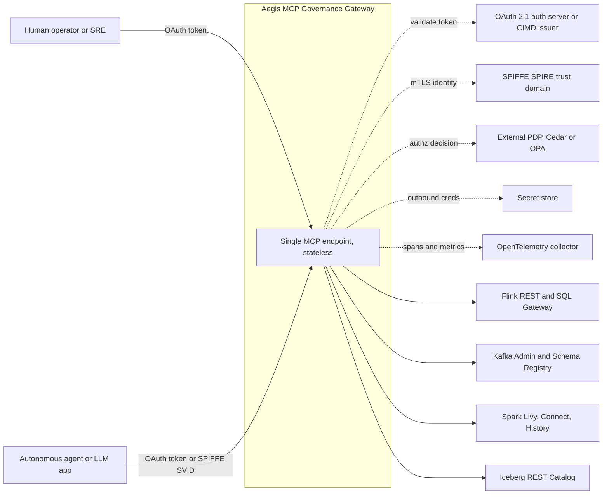

Explanation. This is the gateway as one box among the systems it trusts (a C4 level 1 view).
Operators and agents enter with an OAuth token or a SPIFFE SVID. The dotted control arrows
are trust relationships, not data traffic: validate a token against the auth server,
establish mTLS identity against SPIRE, ask an external PDP for a decision, fetch outbound
credentials from a secret store, and send spans and metrics to the collector. The solid
arrows to Flink, Kafka, Spark, and Iceberg are the actual governed backend calls. The point
is that the gateway is the single trust boundary and everything sensitive is a relationship
it owns, not something an engine sees. See D3 for the deeper walkthrough.

## C2. Gateway core component view

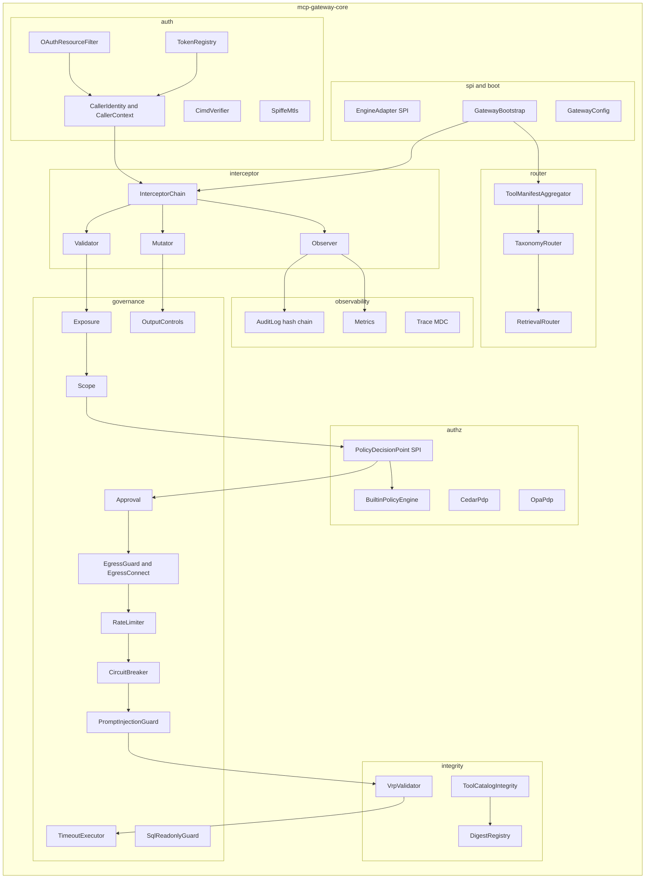

Explanation. This zooms inside mcp-gateway-core. The auth package resolves an identity from
OAuth, CIMD, SPIFFE, or a token file, and hands it to the InterceptorChain. The left to
right validator chain (exposure, scope, PDP, approval, egress, rate, breaker, prompt
injection, VRP, timeout) is the ordered governance pipeline; the PDP fans out to the builtin
engine and the optional Cedar and OPA engines. Mutators run output bounding and redaction,
observers write the audit chain and metrics, and boot wires the chain plus the manifest
aggregator that feeds the routers. Each concern is its own package, dependencies point
downward, and the chain is the one place that composes them in a fixed order. See D4.

## C3. Adapter SPI class model

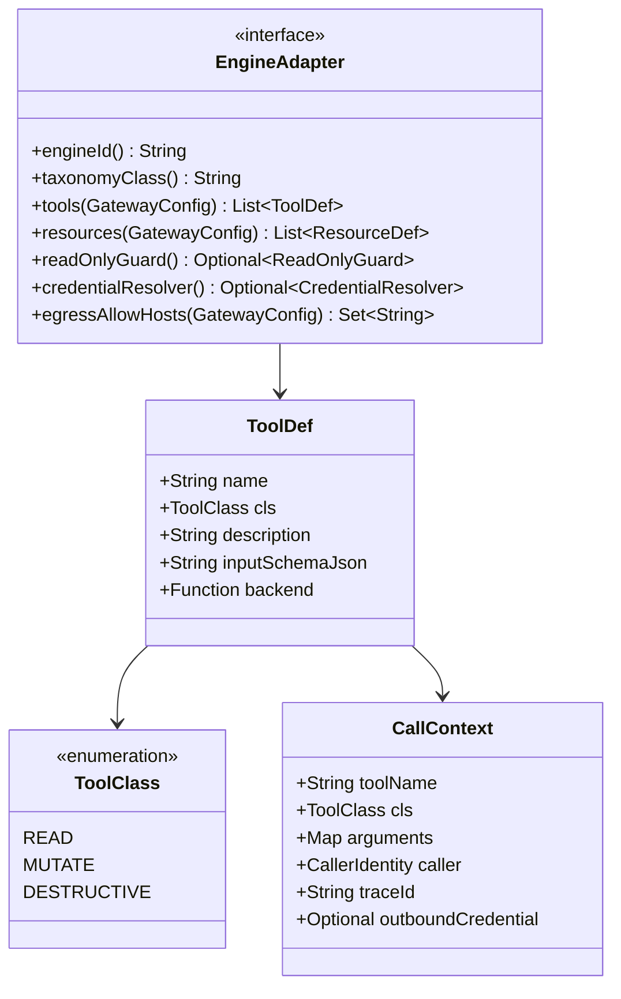

Explanation. This is the small contract an engine implements. EngineAdapter answers engine
id, taxonomy class, tools, resources, an optional read only guard, an optional credential
resolver, and the outbound hosts the gateway may reach for it. ToolDef is a plain record
(name, class, description, JSON schema, and a backend function from CallContext to String).
ToolClass is the enum READ, MUTATE, DESTRUCTIVE, the single value that drives write gating
and approval. CallContext is the immutable per call carrier. An adapter is data plus a
backend function; it never sees MCP SDK types and contributes no policy, which is why adding
an engine is small and safe. See D5.

## C4. Interceptor framework class model

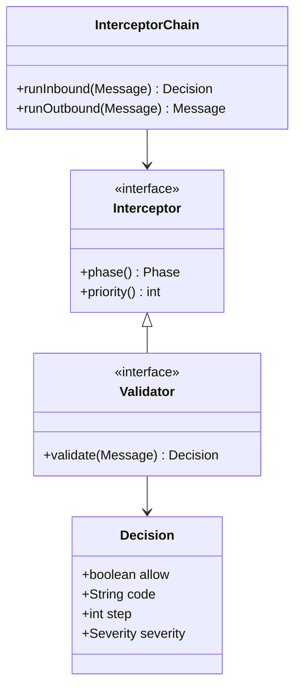

Explanation. The chain is built from three interceptor kinds. Interceptor is the base with a
phase and a priority. A Validator returns a Decision (allow or deny, a stable code, the step
number, a severity). Mutators change the message (sanitize inbound, redact outbound);
observers watch but cannot change the decision. InterceptorChain runs an inbound pass and an
outbound pass. The phase and priority make the order explicit and testable, and the Decision
object carries the stable deny code back to the caller. See D6.

## C5. Sequence: governed tools/call end to end

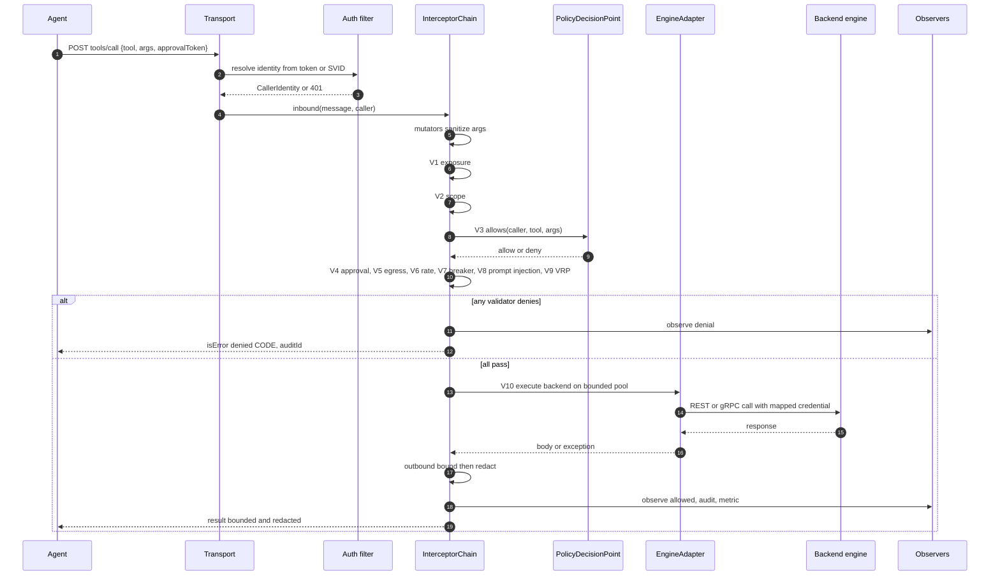

Explanation. This is the full life of one tool call. The transport resolves identity first;
a failure returns 401 before any governance runs. The chain sanitizes arguments, then runs
the validators in order. The alt block is the important part: if any validator denies, the
chain observes the denial and returns an error with a stable code and an audit id, and the
backend is never called; if all pass, the backend runs on a bounded pool, the result is
bounded then redacted, and observers audit the allowed call. First denial wins, nothing
reaches the backend until every gate passes, and both outcomes are audited. See D7.

## C6. Sequence: approval for a destructive tool

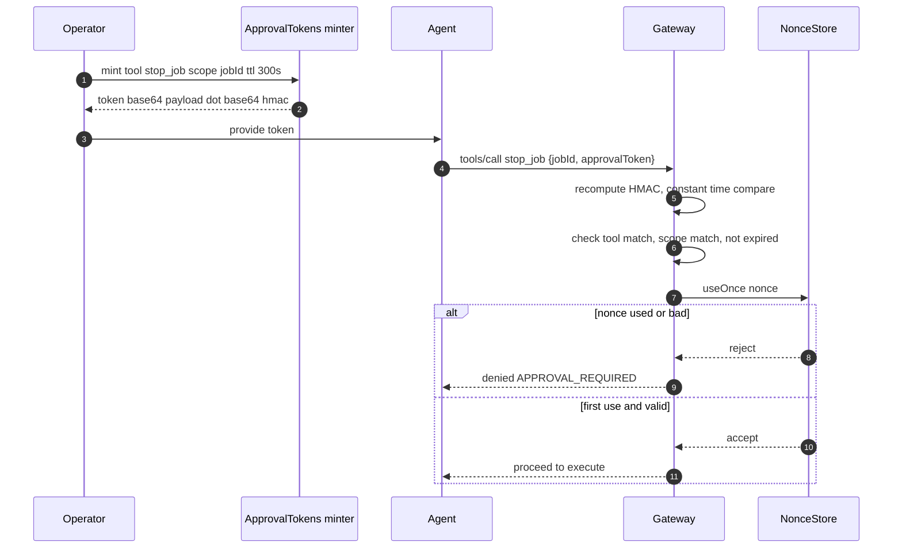

Explanation. Approval is minted out of band by an operator or change system, bound to one
tool, one scope, and a short TTL using the HMAC secret. The agent presents the token on the
destructive call. The gateway recomputes the HMAC and compares in constant time, checks tool
match, scope match, and expiry, then asks the nonce store to use the token once. The alt
block shows that a replayed or invalid token is denied; only a first, valid use proceeds.
Approval is separated from the agent, cryptographically bound, and single use, which defeats
replay and prompt injected reuse. See D8.

## C7. State machine: per tool circuit breaker

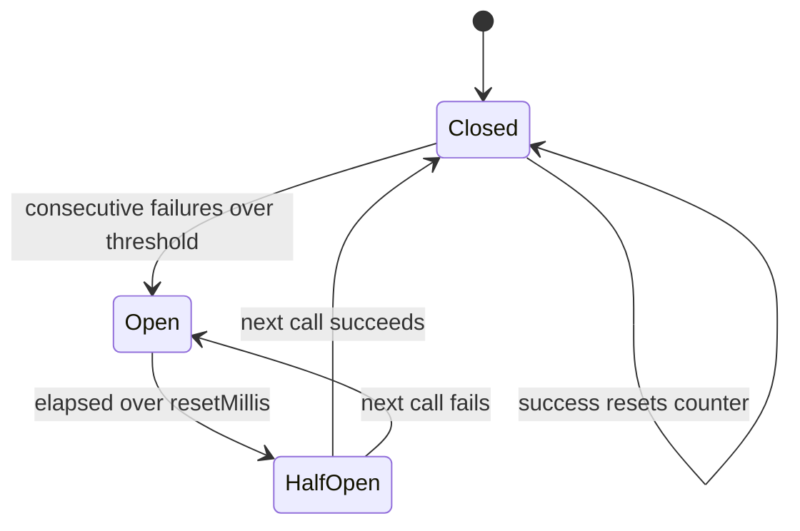

Explanation. Closed is normal; calls pass and a success resets the failure counter.
Consecutive failures beyond the threshold move it to Open, where calls are denied with
BREAKER_OPEN so a failing backend is not hammered. After a reset interval it moves to
HalfOpen, letting one trial call through: success returns to Closed, failure returns to
Open. The breaker is per tool so one unhealthy backend does not deny healthy tools, and it
recovers automatically without operator action. See D9.

## C8. State machine: approval token lifecycle

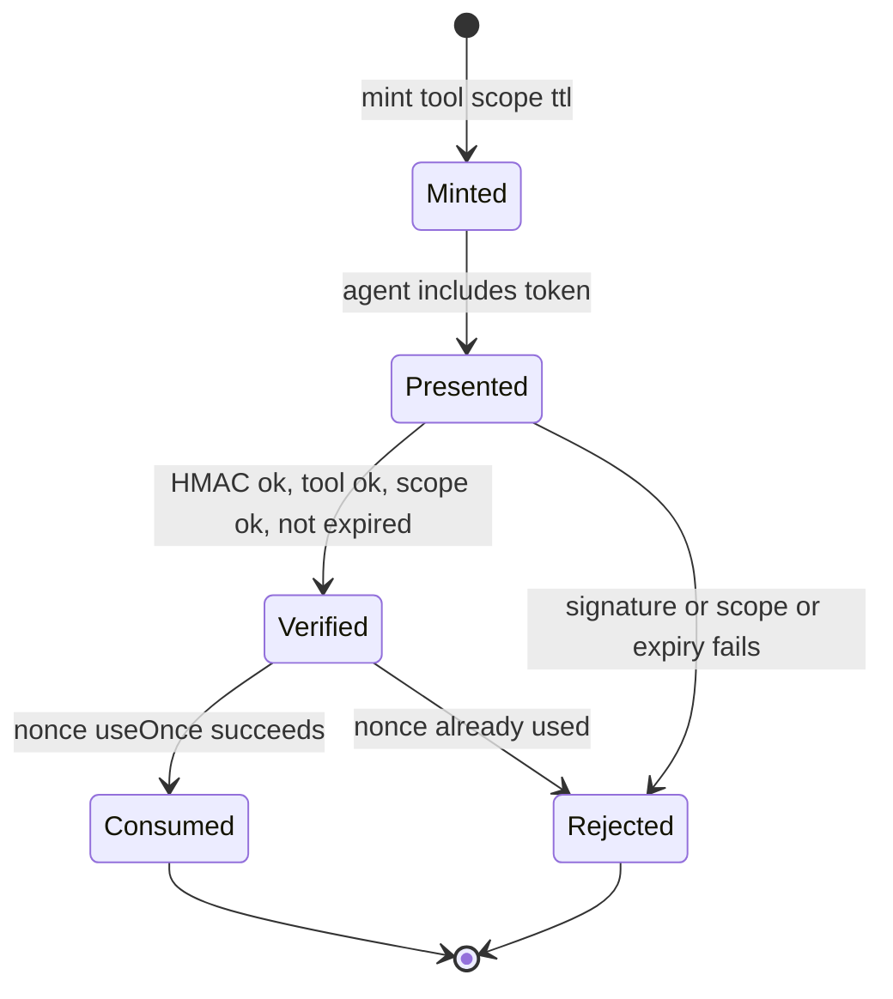

Explanation. This is the states a single token moves through. Minted to Presented when the
agent includes it; Presented to Verified when signature, tool, scope, and expiry all pass,
otherwise Rejected; Verified to Consumed when the nonce use succeeds, and a second attempt is
Rejected as a replay. Consumed and Rejected are terminal. A token has exactly one successful
path and one use; every other route ends in rejection. See D10.

## C9. Data model: audit chain, digest registry, token registry

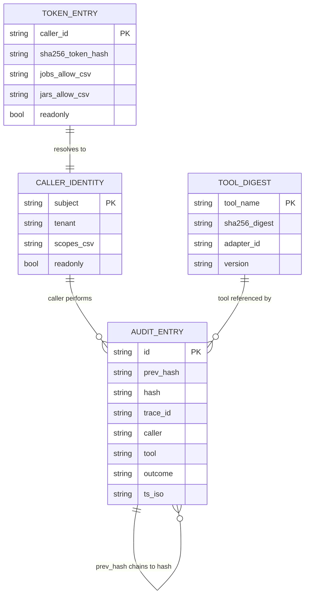

Explanation. AUDIT_ENTRY has prev_hash and hash fields; the self relation is the hash chain,
where each entry commits to the previous one so tampering with history is detectable.
TOOL_DIGEST stores the expected schema digest per tool, which backs rug pull detection.
TOKEN_ENTRY stores a hashed caller token with its allow lists and read only flag, and
resolves to a CALLER_IDENTITY, which performs audit entries. Identity, tool integrity, and
audit are linked so every recorded action ties back to a known caller and a known tool
version. See D11.

## C10. Interceptor directionality

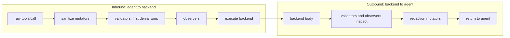

Explanation. Inbound and outbound are not symmetric. Inbound: raw call, then sanitize
mutators, then validators (first denial wins), then observers, then execute. Outbound:
backend body, then validators and observers inspect, then redaction mutators, then return.
The key ordering detail is that outbound bounding happens before redaction, so a truncated
payload cannot cut a secret in half and leave the tail unredacted. Sanitize on the way in,
redact on the way out. See D12.

## C11. Threading and concurrency

- Validators run on the request thread, so caller context is valid at check time, before
  any pool handoff.
- Backend execution runs on a bounded per adapter pool (core 4, max 32, queue 128, daemon
  threads, abort policy) so a slow backend cannot exhaust the gateway.
- A per tool timeout enforces the deadline; on timeout the future is cancelled and the
  breaker records a failure. Timeout is a response deadline, not a cancellation guarantee
  for the underlying call.
- A shutdown hook drains pools and the HTTP server within the configured budget.

## C12. Denial and error code catalog

| Code | Step | Meaning | Breaker impact |
|---|---|---|---|
| NOT_EXPOSED | 1 | tool not registered or not allowed for caller | none |
| READONLY_CALLER | 2 | non read tool for a readonly caller | none |
| SCOPE_DENIED | 2 | target job, jar, or namespace not in caller allow list | none |
| POLICY_DENIED | 3 | PDP returned deny | none |
| APPROVAL_REQUIRED | 4 | missing, expired, replayed, or wrong scope token | none |
| EGRESS_DENIED | 5 | target host not allow listed or link local or metadata | none |
| RATE_LIMITED | 6 | per caller bucket exhausted | none |
| BREAKER_OPEN | 7 | per tool breaker open | none |
| PROMPT_INJECTION | 8 | adversarial payload detected | none |
| VRP_FAILED | 9 | integrity gate not passed for a state mutating tool | none |
| INVALID_INPUT | 10 | identifier or SQL validation failed | no trip |
| TIMEOUT | 10 | backend exceeded per tool deadline | trip |
| BACKEND_ERROR | 10 | backend call failed | trip |

## C13. Configuration surface

| Env key | Default | Purpose |
|---|---|---|
| MCP_GW_TRANSPORT | stdio | stdio or http |
| MCP_GW_HTTP_HOST | 127.0.0.1 | bind host |
| MCP_GW_HTTP_TLS_ENABLED | false | require keystore and password when true |
| MCP_GW_AUTH_MODE | tokenfile | oauth, cimd, spiffe, tokenfile |
| MCP_GW_OAUTH_ISSUER / _AUDIENCE / _JWKS_URL | none | OAuth RS validation |
| MCP_GW_PDP | builtin | builtin, cedar, opa |
| MCP_GW_WRITE_ENABLED | false | master switch for mutate and destructive |
| MCP_GW_APPROVAL_SECRET | none | required when writes enabled |
| MCP_GW_RPS | 5 | per caller rate |
| MCP_GW_TOOL_TIMEOUT_MS | 30000 | per tool deadline |
| MCP_GW_MAX_BYTES | 65536 | output bound |
| MCP_GW_MAX_SQL_CHARS | 32768 | SQL length bound |
| MCP_GW_EGRESS_ALLOW_HOSTS | none | SSRF allow list |
| MCP_GW_TOKEN_BUDGET_DAILY | none | FinOps cap |
| MCP_GW_ADAPTERS | none | comma list of enabled adapters |

Fail fast: validation rejects bad URLs, unknown transport or auth mode, writes without a
secret, http without auth, TLS without keystore, and out of range limits.

## C14. Per adapter endpoint map

Flink (streaming): list_jobs, get_job, get_job_exceptions, run_sql_readonly (READ);
trigger_savepoint, rescale_job (MUTATE); stop_job, cancel_job, run_sql_ddl_dml
(DESTRUCTIVE).

Kafka (messaging): list_topics, describe_topic, query_schema_registry, inspect_dlq (READ);
create_topic, alter_config (MUTATE); reset_offsets, delete_records (DESTRUCTIVE).

Spark (batch): list_applications, get_application, run_sql_readonly (READ); submit_batch,
kill_application (DESTRUCTIVE). Read only SQL needs an operator supplied HTTP SQL endpoint.

Iceberg (lakehouse): list_namespaces, list_tables, get_table_metadata, dry_run_maintenance
(READ); create_namespace, alter_table (MUTATE); expire_snapshots, remove_orphan_files,
rewrite_data_files, commit_transaction, drop_table (DESTRUCTIVE).

## C15. Notes for reviewers

- Every diagram maps to a section of Part B; Part C is the low level view, not a second
  source of truth.
- Where a control ships as a fail closed stub or a partial implementation in the reference
  code (for example external PDP engines, CIMD and SPIFFE auth, and the integrity proof),
  that maturity is recorded in the companion proposal document rather than hidden here.

----------------------------------------------------------------------

# Part D. Diagram walkthroughs

This part explains every diagram in the document in detail: what each node and arrow means,
why it is drawn that way, and what a reviewer should take from it. Each subsection names the
figure by its section number.

## D1. B2 Architecture

What it shows: the top to bottom path a request takes through the gateway, and the fan out
to engines at the bottom.

- Client to Transport. The MCP client or agent connects to exactly one transport, either
  stdio for a local process or Streamable HTTP for a networked deployment. There is a single
  door in.
- Transport to Auth. Before any governance runs, the request is turned into a caller
  identity. If it cannot be, the request is rejected here.
- Auth to Chain. Only an identified request reaches the interceptor chain. This ordering is
  deliberate: identity is the first fact every later step depends on.
- Chain to Router, Integrity, Observability. The chain is the center. It consults the router
  for tool listing and taxonomy, the integrity component for digest pins, and it emits to
  observability on every outcome.
- Router to engines. The router dispatches an allowed call to the correct adapter, which
  calls Flink, Kafka, Spark, Iceberg, or a custom engine.

Takeaway: there is one entry, one governance center, and many engines behind it. An engine
is never reached except through the chain.

## D2. B9 Deployment topology

What it shows: how the single process design scales to a highly available cluster.

- Load balancer to replicas. A plain round robin load balancer with TLS spreads traffic
  across several identical gateway replicas. There are no sticky sessions, which is possible
  because the protocol edge is stateless.
- Replicas to Redis. The dotted arrows to the shared rate and nonce store are the key HA
  detail. Approval nonces and rate counters must be shared, or a replay could pass on a
  second replica and rate limits would be per replica instead of global.
- Replicas to durable audit sink. The audit chain is written to durable storage so history
  survives a replica restart and stays verifiable.
- Replicas to external PDP, secret store, and OTel collector. These are shared platform
  services, drawn dotted because they are optional integrations.
- Replicas to engines. Each replica can reach the engines; a replica can also be pinned to
  one engine for blast radius isolation.

Takeaway: statelessness at the edge plus externalized shared state is what lets the same
code run as one process in development and as N replicas in production.

## D3. C1 System context

What it shows: the gateway as one box among the external systems it trusts and talks to
(a C4 level 1 view).

- Operators and agents enter with an OAuth token or a SPIFFE SVID.
- The dotted control arrows are trust relationships, not data traffic: validate a token
  against the auth server, establish mTLS identity against SPIRE, ask an external PDP for a
  decision, fetch outbound credentials from a secret store, and send spans and metrics to
  the collector.
- The solid arrows to Flink, Kafka, Spark, and Iceberg are the actual governed backend
  calls.

Takeaway: the gateway is the single trust boundary. Everything sensitive (identity, policy,
secrets, audit) is a relationship the gateway owns, not something an engine sees.

## D4. C2 Gateway core component view

What it shows: the internal packages of mcp-gateway-core and how a request flows across
them.

- auth resolves a caller identity from OAuth, CIMD, SPIFFE, or a token file.
- The identity enters the InterceptorChain, which runs validators, mutators, and observers.
- The validator arrow chain (exposure, scope, PDP, approval, egress, rate, breaker, prompt
  injection, VRP, timeout) is the ordered governance pipeline drawn left to right.
- The PDP fans out to the builtin engine and to the optional Cedar and OPA engines.
- Mutators run output controls (bounding and redaction).
- Observers write to the audit chain and metrics.
- boot wires the chain and the manifest aggregator; the aggregator feeds the taxonomy and
  retrieval routers; catalog integrity backs onto the digest registry.

Takeaway: each concern is its own package, dependencies point downward, and the chain is the
one place that composes them in a fixed order.

## D5. C3 Adapter SPI class model

What it shows: the small contract an engine implements and the data types it returns.

- EngineAdapter is the interface. It answers engine id, taxonomy class, tools, resources, an
  optional read only guard, an optional credential resolver, and the outbound hosts the
  gateway may reach for it.
- ToolDef is a plain record: name, class, description, JSON schema string, and a backend
  function that takes a CallContext and returns a String.
- ToolClass is the enum READ, MUTATE, DESTRUCTIVE, the single value that drives write
  gating and approval.
- CallContext is the immutable per call carrier: tool name, class, arguments, caller
  identity, trace id, and the resolved outbound credential.

Takeaway: an adapter is data plus a backend function. It never sees MCP SDK types and
contributes no policy, which is why adding an engine is small and safe.

## D6. C4 Interceptor framework class model

What it shows: how the chain is built from three interceptor kinds.

- Interceptor is the base with a phase and a priority.
- Validator returns a Decision (allow or deny, a code, the step number, a severity).
- Mutators change the message (sanitize inbound, redact outbound); observers watch but
  cannot change the decision.
- InterceptorChain runs an inbound pass and an outbound pass.

Takeaway: the phase and priority make the order explicit and testable, and the Decision
object is what carries the stable deny code back to the caller.

## D7. C5 Sequence: governed tools/call end to end

What it shows: the full life of one tool call, step by step, with the branch between denial
and execution.

- The transport resolves identity first; a failure returns 401 before any governance.
- The chain sanitizes arguments, then runs the validators in order (exposure, scope, PDP,
  approval, egress, rate, breaker, prompt injection, VRP).
- The alt block is the important part: if any validator denies, the chain observes the
  denial and returns an error with a stable code and an audit id, and the backend is never
  called. If all pass, the backend runs on a bounded pool, the result is bounded then
  redacted, and observers audit the allowed call.

Takeaway: first denial wins, nothing reaches the backend until every gate passes, and both
outcomes are audited.

## D8. C6 Sequence: approval for a destructive tool

What it shows: the out of band mint, then the in band verify and single use.

- An operator or change system mints a token bound to one tool, one scope, and a short TTL,
  using the HMAC secret. The token is payload dot signature.
- The agent presents the token on the destructive call.
- The gateway recomputes the HMAC and compares in constant time, checks tool match, scope
  match, and expiry, then asks the nonce store to use the token once.
- The alt block: if the nonce was already used (a replay) or anything fails, the call is
  denied; only a first, valid use proceeds.

Takeaway: approval is separated from the agent (minted elsewhere), cryptographically bound,
and can be used exactly once, which defeats replay and prompt injected reuse.

## D9. C7 State machine: per tool circuit breaker

What it shows: the three breaker states and the transitions between them, per tool.

- Closed is normal; calls pass and a success resets the failure counter.
- Consecutive failures beyond the threshold move it to Open, where calls are denied with
  BREAKER_OPEN so a failing backend is not hammered.
- After a reset interval it moves to HalfOpen, letting one trial call through. Success
  returns to Closed; failure returns to Open.

Takeaway: the breaker is per tool so one unhealthy backend does not deny healthy tools, and
it recovers automatically without operator action.

## D10. C8 State machine: approval token lifecycle

What it shows: the states a single token moves through from mint to terminal.

- Minted to Presented when the agent includes it.
- Presented to Verified when signature, tool, scope, and expiry all pass; otherwise
  Rejected.
- Verified to Consumed when the nonce use succeeds; a second attempt is Rejected as a
  replay.
- Consumed and Rejected are terminal.

Takeaway: a token has exactly one successful path and one use. Every other route ends in
rejection.

## D11. C9 Data model: audit chain, digest registry, token registry

What it shows: the durable and lookup records and how they relate.

- AUDIT_ENTRY has prev_hash and hash fields; the self relation is the hash chain, where each
  entry commits to the previous one so tampering with history is detectable.
- TOOL_DIGEST stores the expected schema digest per tool, which backs rug pull detection.
- TOKEN_ENTRY stores a hashed caller token with its allow lists and read only flag, and
  resolves to a CALLER_IDENTITY.
- CALLER_IDENTITY performs audit entries; TOOL_DIGEST tools are referenced by audit entries.

Takeaway: identity, tool integrity, and audit are linked so every recorded action ties back
to a known caller and a known tool version.

## D12. C10 Interceptor directionality

What it shows: why inbound and outbound passes are not symmetric.

- Inbound: raw call, then sanitize mutators, then validators (first denial wins), then
  observers, then execute.
- Outbound: backend body, then validators and observers inspect, then redaction mutators,
  then return.

The key ordering detail is that outbound bounding happens before redaction, so a truncated
payload cannot cut a secret in half and leave the tail unredacted.

Takeaway: sanitize on the way in, redact on the way out, and the order of bound then redact
is a security property, not a coincidence.

## D13. How the diagrams relate

- B2 and C1 are the same system at two zoom levels: C1 shows the external trust
  relationships, B2 shows the internal top to bottom flow.
- C2 zooms further into the packages that make up the chain in B2.
- C3 and C4 are the static contracts (adapter and interceptor); C5 through C8 are the
  dynamic behavior (call, approval, breaker, token) that those contracts produce.
- C9 is the state those behaviors read and write; B9 is how all of it is deployed for high
  availability.

Read them in that order (C1, B2, C2, C3, C4, C5, C6, C7, C8, C9, B9) for a smooth path from
context to deployment.
