# Low-level design: Apache MCP Governance Gateway

Author: Viquar Khan.

Companion to `DESIGN-apache-mcp-gateway.md`. This document adds the detailed low-level
design with Mermaid diagrams and **implementation notes** that map each diagram to the
Java packages and classes in this repository (Aegis MCP Gateway 0.1.0). Read the DESIGN
doc first for the decisions and rationale; this doc shows how they fit together at the
class and call level. No em dashes. Author-owned components are labeled and optional.

Codename in code is Aegis until any ASF acceptance. Diagrams may say Apache MCP Governance
Gateway as the proposed project name.

## 1. System context (C4 level 1)

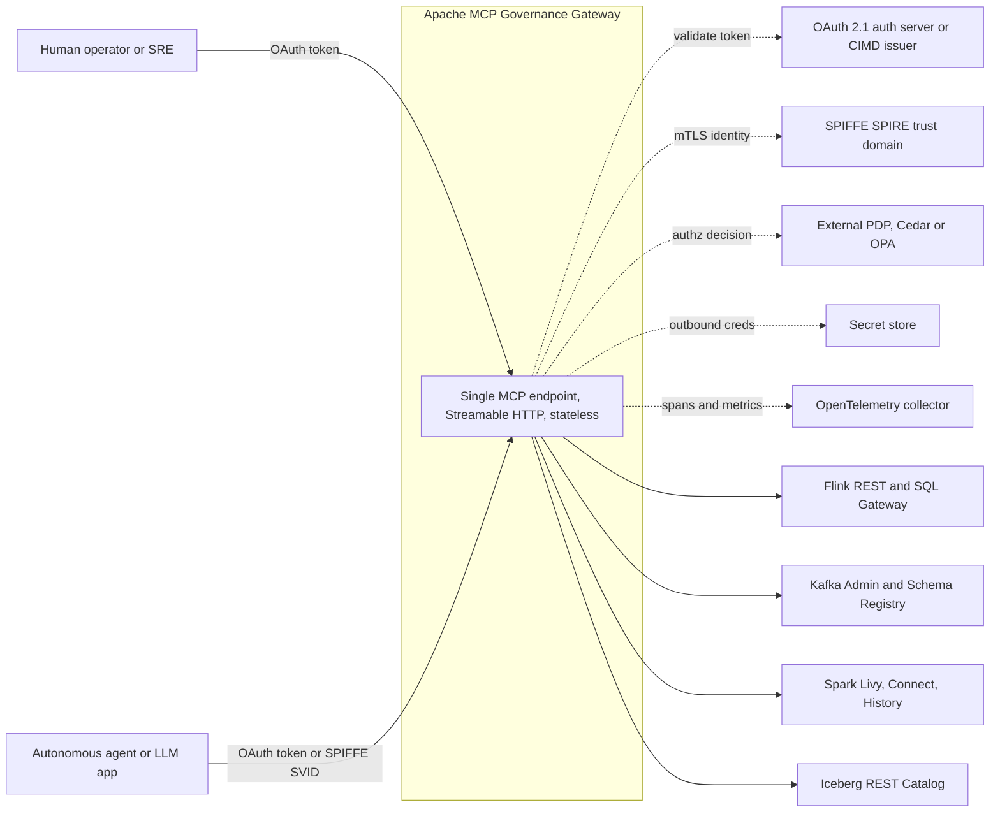
```mermaid
flowchart LR
  Op["Human operator or SRE"]
  Agent["Autonomous agent or LLM app"]
  subgraph GW["Apache MCP Governance Gateway"]
    EP["Single MCP endpoint, Streamable HTTP, stateless"]
  end
  AS["OAuth 2.1 auth server or CIMD issuer"]
  SPIRE["SPIFFE SPIRE trust domain"]
  PDP["External PDP, Cedar or OPA"]
  SEC["Secret store"]
  OTEL["OpenTelemetry collector"]
  Flink["Flink REST and SQL Gateway"]
  Kafka["Kafka Admin and Schema Registry"]
  Spark["Spark Livy, Connect, History"]
  Ice["Iceberg REST Catalog"]
  Op -->|OAuth token| EP
  Agent -->|OAuth token or SPIFFE SVID| EP
  EP -.validate token.-> AS
  EP -.mTLS identity.-> SPIRE
  EP -.authz decision.-> PDP
  EP -.outbound creds.-> SEC
  EP -.spans and metrics.-> OTEL
  EP --> Flink
  EP --> Kafka
  EP --> Spark
  EP --> Ice
```

### Implementation notes

Codename in code and artifacts is **Aegis** (`aegis-mcp-gateway` 0.1.0) until any ASF acceptance.
The single process entry point is `io.github.vaquarkhan.aegis.core.boot.GatewayBootstrap`.

| External dependency | Status in 0.1.0 | Code |
| --- | --- | --- |
| Agent / operator MCP client | Implemented | stdio or streamable HTTP `/mcp` |
| OAuth 2.1 resource server | Implemented when JWKS set | `OAuthResourceFilter` + `JwksJwtValidator`; without JWKS URL every request is 401 |
| CIMD issuer | Stub (fail-closed) | `CimdVerifier`; HTTP mode with `authMode=cimd` refuses to start |
| SPIFFE / SPIRE | Stub (fail-closed) | `SpiffeMtls`; HTTP mode with `authMode=spiffe` refuses to start |
| PDP (Cedar / OPA) | Stub (deny-all) | `CedarPdp`, `OpaPdp`; production path uses `BuiltinPolicyEngine` |
| Secret store | Partial | Outbound headers from token file / `CredentialResolver`; no Vault client yet |
| OpenTelemetry collector | Not wired | Prometheus text via `Metrics` + `/metrics`; OTel spans are a later release |
| Flink / Kafka / Spark / Iceberg | Adapters live | Flink REST/SQL; Kafka AdminClient + SR; Spark History/Livy; Iceberg REST mutate |

stdout is reserved for MCP JSON-RPC. All logs go to stderr through Logback
(`mcp-gateway-core/src/main/resources/logback.xml`).

## 2. Container view (C4 level 2)

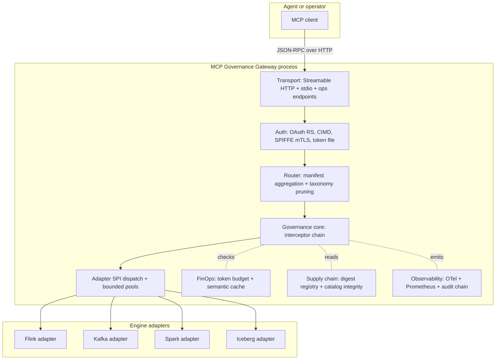
```mermaid
flowchart TB
  subgraph Client["Agent or operator"]
    C1["MCP client"]
  end
  subgraph Gateway["MCP Governance Gateway process"]
    T["Transport: Streamable HTTP + stdio + ops endpoints"]
    A["Auth: OAuth RS, CIMD, SPIFFE mTLS, token file"]
    R["Router: manifest aggregation + taxonomy pruning"]
    G["Governance core: interceptor chain"]
    S["Adapter SPI dispatch + bounded pools"]
    F["FinOps: token budget + semantic cache"]
    SC["Supply chain: digest registry + catalog integrity"]
    O["Observability: OTel + Prometheus + audit chain"]
  end
  subgraph Adapters["Engine adapters"]
    AF["Flink adapter"]
    AK["Kafka adapter"]
    AS2["Spark adapter"]
    AI["Iceberg adapter"]
  end
  C1 -->|JSON-RPC over HTTP| T
  T --> A --> R --> G --> S
  S --> AF
  S --> AK
  S --> AS2
  S --> AI
  G -. reads .- SC
  G -. emits .- O
  G -. checks .- F
```

### Implementation notes

One JVM, six Maven modules:

| Module | Artifact | Role |
| --- | --- | --- |
| Parent | `aegis-mcp-gateway` | BOM, plugin versions, Java 17 |
| Core | `mcp-gateway-core` | SPI, auth, chain, config, transport, boot |
| Flink | `mcp-adapter-flink` | Streaming taxonomy; REST + SQL Gateway clients |
| Kafka | `mcp-adapter-kafka` | Messaging taxonomy; AdminClient planned |
| Spark | `mcp-adapter-spark` | Batch taxonomy; History JDK HTTP; Livy planned |
| Iceberg | `mcp-adapter-iceberg` | Lakehouse taxonomy; REST catalog client |
| Dist | `mcp-gateway-dist` | Shade jar `aegis-mcp-gateway-0.1.0-all.jar`, Docker, Helm |

Request path inside the process:

1. Transport (`StdioBoot` or `StreamableHttpTransport` + Jetty 12 ee10)
2. Auth filter (`BearerAuthFilter`, `OAuthResourceFilter`, or refuse for CIMD/SPIFFE)
3. MCP SDK `tools/call` handler in `GatewayBootstrap`
4. `InterceptorChain.execute(ToolDef, CallContext)`
5. Adapter backend `Function<CallContext, String>` on `TimeoutExecutor`
6. Observers (`Trace`, `Metrics`, `AuditLog`) on every outcome

## 3. Gateway core component view

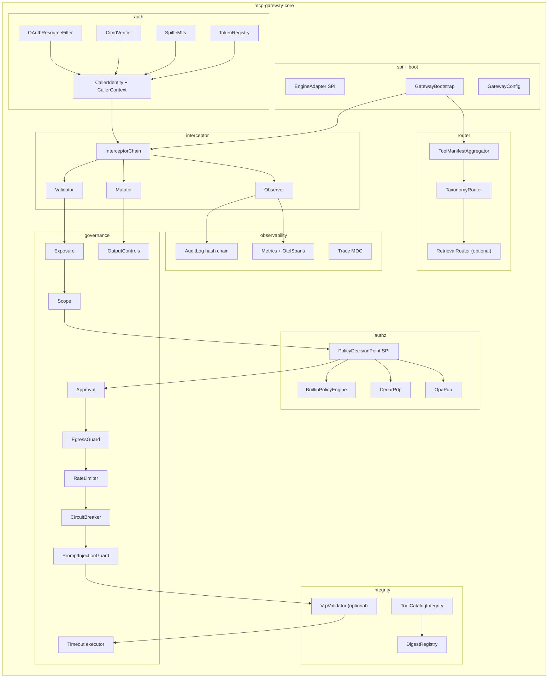
```mermaid
flowchart TB
  subgraph Core["mcp-gateway-core"]
    direction TB
    subgraph AuthPkg["auth"]
      OAuth["OAuthResourceFilter"]
      Cimd["CimdVerifier"]
      Spiffe["SpiffeMtls"]
      TokReg["TokenRegistry"]
      CID["CallerIdentity + CallerContext"]
    end
    subgraph AuthzPkg["authz"]
      PDPsp["PolicyDecisionPoint SPI"]
      Builtin["BuiltinPolicyEngine"]
      Cedar["CedarPdp"]
      Opa["OpaPdp"]
    end
    subgraph IcpPkg["interceptor"]
      Chain["InterceptorChain"]
      Mut["Mutator"]
      Val["Validator"]
      Obs["Observer"]
    end
    subgraph GovPkg["governance"]
      Exp["Exposure"]
      Scope["Scope"]
      Appr["Approval"]
      Rate["RateLimiter"]
      Brk["CircuitBreaker"]
      Egr["EgressGuard"]
      Pi["PromptInjectionGuard"]
      Out["OutputControls"]
      Tmo["Timeout executor"]
    end
    subgraph IntPkg["integrity"]
      Vrp["VrpValidator (optional)"]
      Dig["DigestRegistry"]
      Cat["ToolCatalogIntegrity"]
    end
    subgraph RtrPkg["router"]
      Agg["ToolManifestAggregator"]
      Tax["TaxonomyRouter"]
      Ret["RetrievalRouter (optional)"]
    end
    subgraph ObsPkg["observability"]
      Tr["Trace MDC"]
      Aud["AuditLog hash chain"]
      Met["Metrics + OtelSpans"]
    end
    subgraph SpiPkg["spi + boot"]
      Adp["EngineAdapter SPI"]
      Boot["GatewayBootstrap"]
      Cfg["GatewayConfig"]
    end
  end
  OAuth --> CID
  Cimd --> CID
  Spiffe --> CID
  TokReg --> CID
  CID --> Chain
  Chain --> Val
  Chain --> Mut
  Chain --> Obs
  Val --> Exp --> Scope --> PDPsp --> Appr --> Egr --> Rate --> Brk --> Pi --> Vrp --> Tmo
  PDPsp --> Builtin
  PDPsp --> Cedar
  PDPsp --> Opa
  Mut --> Out
  Obs --> Aud
  Obs --> Met
  Boot --> Chain
  Boot --> Agg
  Agg --> Tax --> Ret
  Cat --> Dig
```

### Implementation notes

Base package: `io.github.vaquarkhan.aegis.core`.

| Package | Key types | Notes |
| --- | --- | --- |
| `auth` | `CallerIdentity`, `CallerContext`, `BearerAuthFilter`, `TokenRegistry`, `NonceStore`, `OAuthResourceFilter`, `CimdVerifier`, `SpiffeMtls` | ThreadLocal identity; token file hashed inbound |
| `authz` | `PolicyDecisionPoint`, `BuiltinPolicyEngine`, `CedarPdp`, `OpaPdp` | `MCP_GW_PDP` = builtin, cedar, or opa |
| `interceptor` | `InterceptorChain`, `ArgumentSanitizeMutator`, `Mutator`, `Validator`, `Observer`, `Decision`, `Phase`, `Severity` | Ten hard-coded steps plus pluggable mutators/observers |
| `governance` | `Exposure`, `Scope`, `Approval` (+ `ApprovalTokens` alias), `RateLimiter`, `CircuitBreaker`, `EgressGuard`, `PromptInjectionGuard`, `OutputControls`, `TimeoutExecutor`, `SqlReadonlyGuard` | Steps 1-8 and 10 pool |
| `integrity` | `VrpValidator`, `DigestRegistry`, `ToolCatalogIntegrity` | Rug-pull digests; dry-run receipt VRP |
| `router` | `ToolManifestAggregator`, `TaxonomyRouter`, `RetrievalRouter` | Overlay authority-reduction only |
| `observability` | `Trace`, `AuditLog`, `Metrics` | MDC `trace`; SHA-256 audit chain; Prometheus |
| `finops` | `TokenBudget`, `SemanticCache` | Daily cap enforced; READ cache |
| `config` | `GatewayConfig`, `AdapterRegistry` | Env wins over `MCP_GW_CONFIG` YAML |
| `yaml` | `YamlManifestLoader` | SafeConstructor; tool overlays |
| `transport` | `StreamableHttpTransport`, `StdioBoot`, `TlsSettings`, `OpsServlet` | `/healthz` `/readyz` `/metrics` |
| `spi` | `EngineAdapter`, `ToolDef`, `ResourceDef`, `CallContext`, ... | No MCP SDK types in SPI |
| `boot` | `GatewayBootstrap` | Main class for the shaded jar |
| `util` | `Inputs` | `requireId`, `requireTopic`, `jsonEscape`, ... |

Wiring order in `GatewayBootstrap.run()`: `GatewayConfig.fromEnv` -> `AdapterRegistry.discover` ->
`ToolManifestAggregator.aggregate` -> build chain -> register exposed tools -> start transport.
Shutdown calls `OpsServlet.markNotLive()` before draining the pool.

## 4. Class model: adapter SPI and interceptor framework

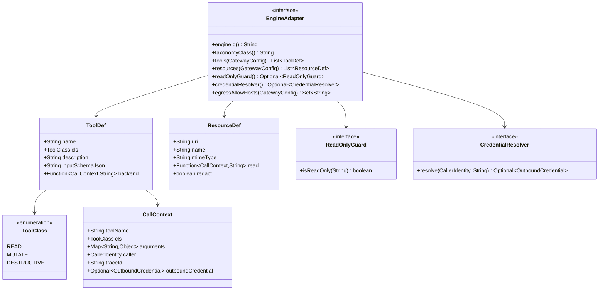
```mermaid
classDiagram
  class EngineAdapter {
    <<interface>>
    +engineId() String
    +taxonomyClass() String
    +tools(GatewayConfig) List~ToolDef~
    +resources(GatewayConfig) List~ResourceDef~
    +readOnlyGuard() Optional~ReadOnlyGuard~
    +credentialResolver() Optional~CredentialResolver~
    +egressAllowHosts(GatewayConfig) Set~String~
  }
  class ToolDef {
    +String name
    +ToolClass cls
    +String description
    +String inputSchemaJson
    +Function~CallContext,String~ backend
  }
  class ResourceDef {
    +String uri
    +String name
    +String mimeType
    +Function~CallContext,String~ read
    +boolean redact
  }
  class ReadOnlyGuard {
    <<interface>>
    +isReadOnly(String) boolean
  }
  class CredentialResolver {
    <<interface>>
    +resolve(CallerIdentity, String) Optional~OutboundCredential~
  }
  class CallContext {
    +String toolName
    +ToolClass cls
    +Map~String,Object~ arguments
    +CallerIdentity caller
    +String traceId
    +Optional~OutboundCredential~ outboundCredential
  }
  class ToolClass {
    <<enumeration>>
    READ
    MUTATE
    DESTRUCTIVE
  }
  EngineAdapter --> ToolDef
  EngineAdapter --> ResourceDef
  EngineAdapter --> ReadOnlyGuard
  EngineAdapter --> CredentialResolver
  ToolDef --> ToolClass
  ToolDef --> CallContext
```

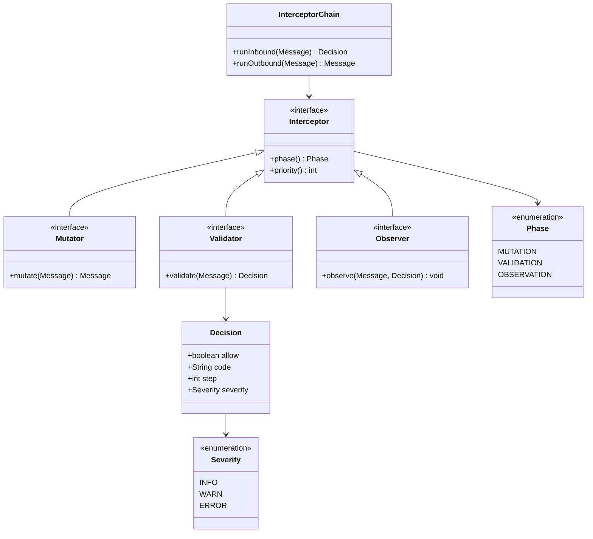
```mermaid
classDiagram
  class Interceptor {
    <<interface>>
    +phase() Phase
    +priority() int
  }
  class Mutator {
    <<interface>>
    +mutate(Message) Message
  }
  class Validator {
    <<interface>>
    +validate(Message) Decision
  }
  class Observer {
    <<interface>>
    +observe(Message, Decision) void
  }
  class InterceptorChain {
    +runInbound(Message) Decision
    +runOutbound(Message) Message
  }
  class Decision {
    +boolean allow
    +String code
    +int step
    +Severity severity
  }
  class Phase {
    <<enumeration>>
    MUTATION
    VALIDATION
    OBSERVATION
  }
  class Severity {
    <<enumeration>>
    INFO
    WARN
    ERROR
  }
  Interceptor <|-- Mutator
  Interceptor <|-- Validator
  Interceptor <|-- Observer
  InterceptorChain --> Interceptor
  Validator --> Decision
  Decision --> Severity
  Interceptor --> Phase
```

### Implementation notes (SPI)

All SPI types live under `io.github.vaquarkhan.aegis.core.spi` and are plain Java (no MCP SDK).

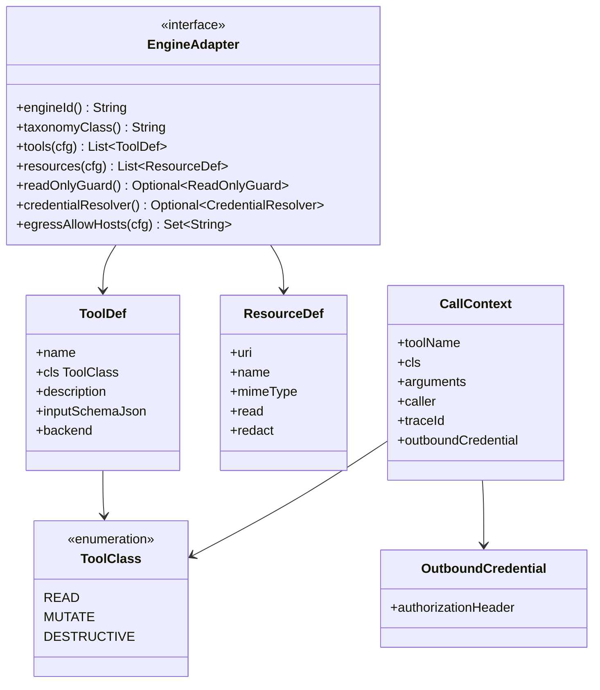
```mermaid
classDiagram
  class EngineAdapter {
    <<interface>>
    +engineId() String
    +taxonomyClass() String
    +tools(cfg) List~ToolDef~
    +resources(cfg) List~ResourceDef~
    +readOnlyGuard() Optional~ReadOnlyGuard~
    +credentialResolver() Optional~CredentialResolver~
    +egressAllowHosts(cfg) Set~String~
  }
  class ToolDef {
    +name
    +cls ToolClass
    +description
    +inputSchemaJson
    +backend
  }
  class ResourceDef {
    +uri
    +name
    +mimeType
    +read
    +redact
  }
  class CallContext {
    +toolName
    +cls
    +arguments
    +caller
    +traceId
    +outboundCredential
  }
  class OutboundCredential {
    +authorizationHeader
  }
  class ToolClass {
    <<enumeration>>
    READ
    MUTATE
    DESTRUCTIVE
  }
  EngineAdapter --> ToolDef
  EngineAdapter --> ResourceDef
  ToolDef --> ToolClass
  CallContext --> OutboundCredential
  CallContext --> ToolClass
```

Adapters are discovered with `ServiceLoader` via
`META-INF/services/io.github.vaquarkhan.aegis.core.spi.EngineAdapter`, then filtered by
`MCP_GW_ADAPTERS`. Core never depends on engine client libraries.

### Implementation notes (interceptor framework)

| LLD type | Java type | Behavior |
| --- | --- | --- |
| `Interceptor` | `interceptor.Interceptor` | `name()`, `phase()`, `priority()` (default 100), `step()`, `apply(CallContext)` |
| `Mutator` | `interceptor.Mutator` | `mutate(CallContext)`; default `ArgumentSanitizeMutator` trims string args |
| `Validator` | `interceptor.Validator` | `validate(CallContext)` returns `Decision` |
| `Observer` | `interceptor.Observer` | `observe(ctx, decision)` / `onOutcome(ctx, decision, elapsedMillis)` |
| `Phase` | `MUTATION`, `VALIDATION`, `OBSERVATION` (+ deprecated `PRE`/`EXECUTE`/`POST` aliases) |
| `InterceptorChain` | `execute(ToolDef, CallContext)` plus `runInbound` / `runOutbound` | |
| `Decision` | record `(allowed, code, step, severity, message)` | field name is `allowed` |

The production chain still hard-codes steps 1-10 for deterministic security ordering. Mutators run
before `preflight`. Observers cannot change the decision.

## 5. Class model: governance and auth

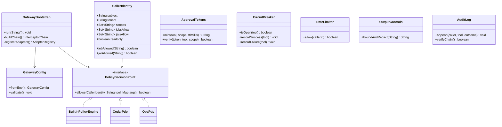
```mermaid
classDiagram
  class GatewayBootstrap {
    +run(String[]) void
    -buildChain() InterceptorChain
    -registerAdapters() AdapterRegistry
  }
  class GatewayConfig {
    +fromEnv() GatewayConfig
    +validate() void
  }
  class CallerIdentity {
    +String subject
    +String tenant
    +Set~String~ scopes
    +Set~String~ jobsAllow
    +Set~String~ jarsAllow
    +boolean readonly
    +jobAllowed(String) boolean
    +jarAllowed(String) boolean
  }
  class PolicyDecisionPoint {
    <<interface>>
    +allows(CallerIdentity, String tool, Map args) boolean
  }
  class ApprovalTokens {
    +mint(tool, scope, ttlMillis) String
    +verify(token, tool, scope) boolean
  }
  class CircuitBreaker {
    +isOpen(tool) boolean
    +recordSuccess(tool) void
    +recordFailure(tool) void
  }
  class RateLimiter {
    +allow(callerId) boolean
  }
  class OutputControls {
    +boundAndRedact(String) String
  }
  class AuditLog {
    +append(caller, tool, outcome) void
    +verifyChain() boolean
  }
  GatewayBootstrap --> GatewayConfig
  GatewayBootstrap --> PolicyDecisionPoint
  PolicyDecisionPoint <|.. BuiltinPolicyEngine
  PolicyDecisionPoint <|.. CedarPdp
  PolicyDecisionPoint <|.. OpaPdp
  CallerIdentity --> PolicyDecisionPoint
```

### Implementation notes

**GatewayBootstrap** (`boot.GatewayBootstrap`): `VERSION=0.1.0`, `SERVER_NAME=aegis-mcp-gateway`,
`MCP_ENDPOINT=/mcp`. Builds MCP tools with
`Tool.builder().inputSchema(McpJsonMapper, String)` and
`new JacksonMcpJsonMapperSupplier().get()`. Never passes a Jackson `ObjectMapper` into a transport.

**GatewayConfig** (`config.GatewayConfig`): `fromEnv()`, optional YAML via `MCP_GW_CONFIG`,
`validate()` fail-fast, `adapterProperty(key, default)` for engine endpoints,
`writesUnlocked()` requires write flag and non-blank approval secret.

**CallerIdentity** (`auth.CallerIdentity`): `subject`, `tenant`, `scopes`, `jobsAllow`,
`jarsAllow`, `readonly`, `outboundAuthHeader`; helpers `jobAllowed`, `jarAllowed`, `scopeAllowed`,
`callerId()` (= subject). Empty allow lists fail closed.

**TokenRegistry** line formats:

- LLD: `callerId:sha256Hex:jobsCsv:jarsCsv:readonly[:outboundAuth]`
- Legacy: `callerId:sha256Hex:scopesCsv:readonly` (scopes mirrored onto jobs and jars)

Inbound tokens are hashed only (SHA-256). Lookup uses constant-time compare.

**Approval**: class `governance.Approval` implements mint/verify; `ApprovalTokens` is a thin
alias for the LLD name. Token shape:
`base64url(tool|scope|expMillis|nonce).base64url(HMAC-SHA256)`. CLI mint prints only the token
on stdout.

**PolicyDecisionPoint**: `allows(CallerIdentity, String tool, Map args)` with default
`allows(CallContext)`. Builtin policy file lines: `deny tool <glob>`, `deny job <glob>`; missing
file fails closed. OPA posts to an http(s) data URL (fail-closed). Cedar uses cedar-lite deny
files or the same HTTP contract; a full Cedar runtime is on the [ROADMAP](../ROADMAP.md).

**RateLimiter**: `allow(callerId)` with a `ConcurrentHashMap` of one-second fixed windows.
**CircuitBreaker**: per-tool CLOSED / OPEN / HALF_OPEN with a single half-open probe.
**OutputControls**: `boundAndRedact` = bound first, then DLP redact (secrets, JWT, PEM, email → `PERSON_N`, Bearer).

## 6. Sequence: governed tools/call (end to end)

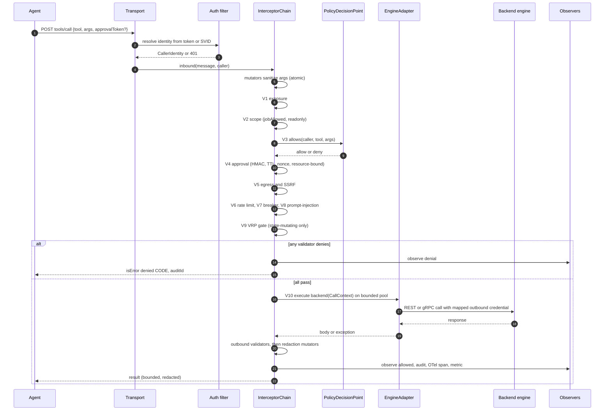
```mermaid
sequenceDiagram
  autonumber
  participant Ag as Agent
  participant T as Transport
  participant Au as Auth filter
  participant Ch as InterceptorChain
  participant PDP as PolicyDecisionPoint
  participant Ad as EngineAdapter
  participant Be as Backend engine
  participant Ob as Observers

  Ag->>T: POST tools/call {tool, args, approvalToken?}
  T->>Au: resolve identity from token or SVID
  Au-->>T: CallerIdentity or 401
  T->>Ch: inbound(message, caller)
  Ch->>Ch: mutators sanitize args (atomic)
  Ch->>Ch: V1 exposure
  Ch->>Ch: V2 scope (jobAllowed, readonly)
  Ch->>PDP: V3 allows(caller, tool, args)
  PDP-->>Ch: allow or deny
  Ch->>Ch: V4 approval (HMAC, TTL, nonce, resource-bound)
  Ch->>Ch: V5 egress and SSRF
  Ch->>Ch: V6 rate limit, V7 breaker, V8 prompt-injection
  Ch->>Ch: V9 VRP gate (state-mutating only)
  alt any validator denies
    Ch->>Ob: observe denial
    Ch-->>Ag: isError denied CODE, auditId
  else all pass
    Ch->>Ad: V10 execute backend(CallContext) on bounded pool
    Ad->>Be: REST or gRPC call with mapped outbound credential
    Be-->>Ad: response
    Ad-->>Ch: body or exception
    Ch->>Ch: outbound validators, then redaction mutators
    Ch->>Ob: observe allowed, audit, OTel span, metric
    Ch-->>Ag: result (bounded, redacted)
  end
```

### Implementation notes

Mapped call path:

1. HTTP: Jetty serves `HttpServletStreamableServerTransportProvider` at `/mcp/*` behind the auth
   filter. Stdio: `StdioServerTransportProvider(json)`.
2. Auth sets `BearerAuthFilter.ATTR_CALLER` and `CallerContext` ThreadLocal.
3. Tool handler builds `CallContext`, resolves optional `CredentialResolver` outbound header,
   then `chain.execute(tool, ctx)`.
4. Mutators (`ArgumentSanitizeMutator`) then `preflight` steps 1-9.
5. Optional `SemanticCache` hit for READ tools.
6. Pre-flight `TokenBudget` check when enabled.
7. `TimeoutExecutor.submit(backend, caller)` then `future.get(toolTimeoutMillis)`.
8. On success: `breaker.recordSuccess`, `output.boundAndRedact`, cache put, budget consume
   (deny `BUDGET_EXCEEDED` if over), optional VRP dry-run receipt append.
9. Observers always run in `finish`.

Denial body format returned to the model: `denied: <CODE>` (and timeout detail when applicable).
Audit outcome format: `DENIED:<CODE>:step<N>` or `ALLOWED`.

## 7. Sequence: tools/list with taxonomy routing

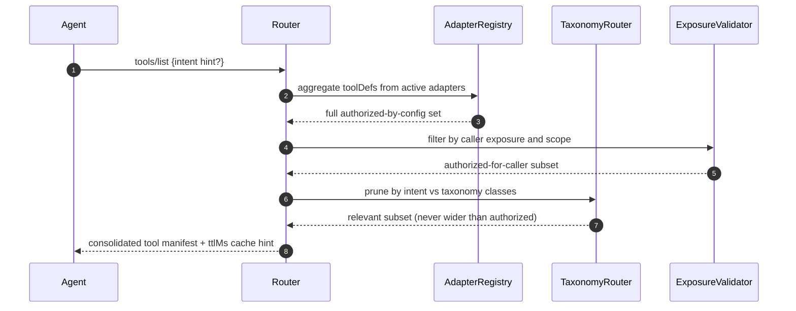
```mermaid
sequenceDiagram
  autonumber
  participant Ag as Agent
  participant R as Router
  participant Reg as AdapterRegistry
  participant Tax as TaxonomyRouter
  participant Ch as ExposureValidator

  Ag->>R: tools/list {intent hint?}
  R->>Reg: aggregate toolDefs from active adapters
  Reg-->>R: full authorized-by-config set
  R->>Ch: filter by caller exposure and scope
  Ch-->>R: authorized-for-caller subset
  R->>Tax: prune by intent vs taxonomy classes
  Tax-->>R: relevant subset (never wider than authorized)
  R-->>Ag: consolidated tool manifest + ttlMs cache hint
```

### Implementation notes

At startup `ToolManifestAggregator`:

1. Collects `ToolDef` / `ResourceDef` from each enabled adapter.
2. Applies `tools.yaml` overlay (rename, description, force lower class, digest pin, drop). Overlay
   cannot raise `ToolClass` or invent a backend.
3. Pins digests via `ToolCatalogIntegrity` / `DigestRegistry` (rug-pull defense).
4. Builds `TaxonomyRouter` (`toolName -> engineId -> taxonomyClass`).
5. Unions `egressAllowHosts`.

`GatewayBootstrap.buildToolSpecs` then drops tools that `Exposure.isExposed` rejects, so
`MUTATE`/`DESTRUCTIVE` never appear in `tools/list` when writes are locked.

`RetrievalRouter` is optional intent pruning (`prune(authorizedTools, intentHint)`); it never
widens the authorized set. Full per-caller dynamic `tools/list` filtering for multi-token
registries is planned; registration-time exposure is the 0.1.0 control.

## 8. Sequence: OAuth 2.1 resource-server validation

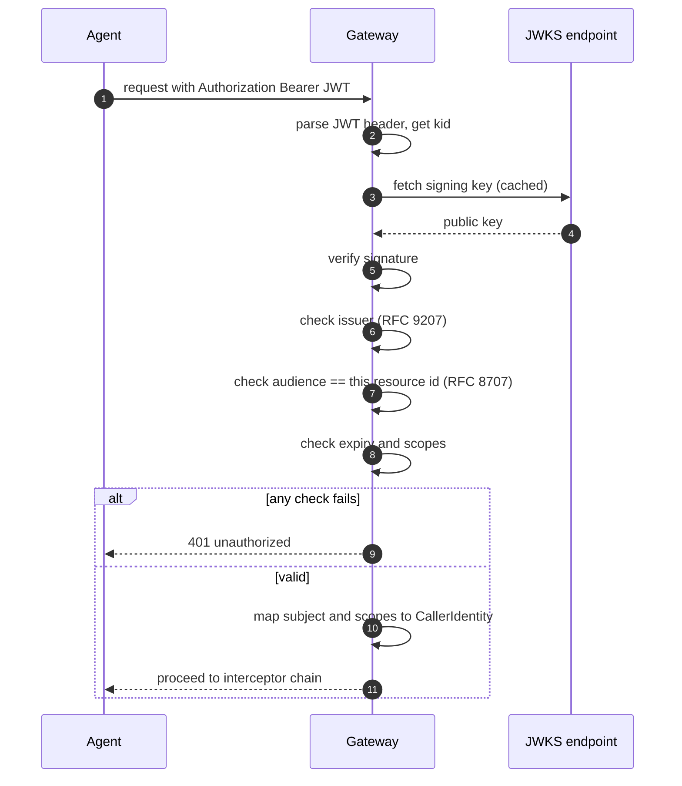
```mermaid
sequenceDiagram
  autonumber
  participant Ag as Agent
  participant GW as Gateway
  participant JWKS as JWKS endpoint
  Ag->>GW: request with Authorization Bearer JWT
  GW->>GW: parse JWT header, get kid
  GW->>JWKS: fetch signing key (cached)
  JWKS-->>GW: public key
  GW->>GW: verify signature
  GW->>GW: check issuer (RFC 9207)
  GW->>GW: check audience == this resource id (RFC 8707)
  GW->>GW: check expiry and scopes
  alt any check fails
    GW-->>Ag: 401 unauthorized
  else valid
    GW->>GW: map subject and scopes to CallerIdentity
    GW-->>Ag: proceed to interceptor chain
  end
```

### Implementation notes

Class: `auth.OAuthResourceFilter`.

Config: `MCP_GW_AUTH_MODE=oauth`, `MCP_GW_OAUTH_ISSUER`, `MCP_GW_OAUTH_AUDIENCE`,
`MCP_GW_OAUTH_JWKS_URL` (required for admit), `MCP_GW_OAUTH_REQUIRED_SCOPE`, optional write scope.

**0.1.0 behavior:** with `MCP_GW_OAUTH_JWKS_URL` set, `JwksJwtValidator` fetches JWKS (Nimbus),
verifies signature, `iss` / `aud` / `exp` / `nbf`, and maps scopes onto `CallerIdentity` before
`chain.doFilter`. Without a JWKS URL the filter denies every request (401). Issuer and audience
must still be configured or startup fails. URLs are scheme-checked in `GatewayConfig.validate()`.

## 9. Sequence: CIMD stateless client registration

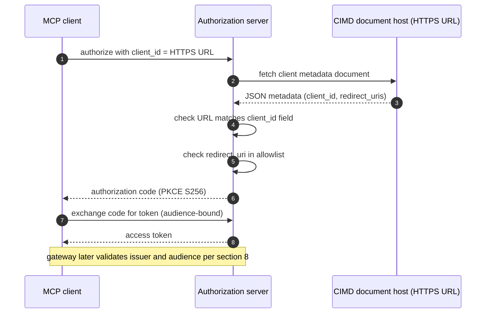
```mermaid
sequenceDiagram
  autonumber
  participant Cl as MCP client
  participant AS as Authorization server
  participant Doc as CIMD document host (HTTPS URL)
  Cl->>AS: authorize with client_id = HTTPS URL
  AS->>Doc: fetch client metadata document
  Doc-->>AS: JSON metadata (client_id, redirect_uris)
  AS->>AS: check URL matches client_id field
  AS->>AS: check redirect_uri in allowlist
  AS-->>Cl: authorization code (PKCE S256)
  Cl->>AS: exchange code for token (audience-bound)
  AS-->>Cl: access token
  Note over Cl,AS: gateway later validates issuer and audience per section 8
```

### Implementation notes

Class: `auth.CimdVerifier`.

Config: `MCP_GW_AUTH_MODE=cimd`, `MCP_GW_CIMD_METADATA_URL` (https URL validated at startup).

**0.1.0 behavior:** compile-safe stub. `GatewayBootstrap.buildAuthFilter` refuses to start HTTP
in CIMD mode rather than accepting unverified clients. Document fetch, `client_id` URL match,
redirect allowlist and PKCE exchange remain future work (authorization server side plus gateway
token validation per section 8).

## 10. Sequence: SPIFFE workload identity over mTLS

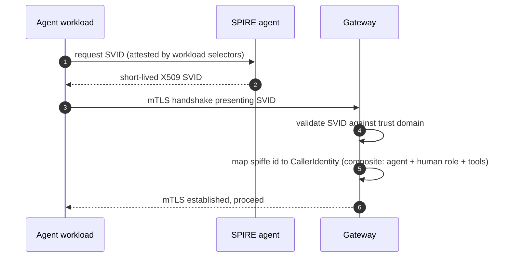
```mermaid
sequenceDiagram
  autonumber
  participant Ag as Agent workload
  participant SPIRE as SPIRE agent
  participant GW as Gateway
  Ag->>SPIRE: request SVID (attested by workload selectors)
  SPIRE-->>Ag: short-lived X509 SVID
  Ag->>GW: mTLS handshake presenting SVID
  GW->>GW: validate SVID against trust domain
  GW->>GW: map spiffe id to CallerIdentity (composite: agent + human role + tools)
  GW-->>Ag: mTLS established, proceed
```

### Implementation notes

Class: `auth.SpiffeMtls`.

Config: `MCP_GW_AUTH_MODE=spiffe`, `MCP_GW_SPIFFE_TRUST_DOMAIN`,
`MCP_GW_SPIFFE_SOCKET` (preferred) or legacy `MCP_GW_SPIFFE_WORKLOAD_API`.

**0.1.0 behavior:** stub. HTTP + spiffe mode refuses to start. SVID attestation, trust-domain
validation and SPIFFE-ID to `CallerIdentity` mapping are not implemented.
TLS for the HTTP listener itself is separate (`MCP_GW_HTTP_TLS_*` + `TlsSettings` on Jetty).

## 11. Sequence: approval for a destructive tool

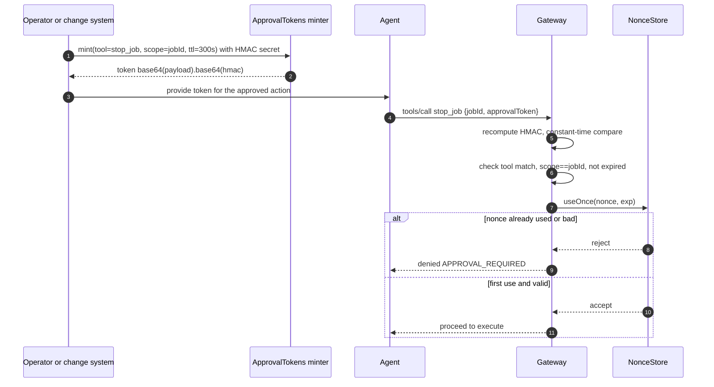
```mermaid
sequenceDiagram
  autonumber
  participant Op as Operator or change system
  participant CLI as ApprovalTokens minter
  participant Ag as Agent
  participant GW as Gateway
  participant Non as NonceStore
  Op->>CLI: mint(tool=stop_job, scope=jobId, ttl=300s) with HMAC secret
  CLI-->>Op: token base64(payload).base64(hmac)
  Op->>Ag: provide token for the approved action
  Ag->>GW: tools/call stop_job {jobId, approvalToken}
  GW->>GW: recompute HMAC, constant-time compare
  GW->>GW: check tool match, scope==jobId, not expired
  GW->>Non: useOnce(nonce, exp)
  alt nonce already used or bad
    Non-->>GW: reject
    GW-->>Ag: denied APPROVAL_REQUIRED
  else first use and valid
    Non-->>GW: accept
    GW-->>Ag: proceed to execute
  end
```

### Implementation notes

Classes: `governance.Approval`, `governance.ApprovalTokens` (alias), `auth.NonceStore`.

Mint CLI:

```bash
java -cp mcp-gateway-core/target/classes \
  io.github.vaquarkhan.aegis.core.governance.Approval \
  "$MCP_GW_APPROVAL_SECRET" stop_job job-42 300
```

(or the `ApprovalTokens` main entry). Prints a single token line on stdout.

Verify path in `InterceptorChain` step 4 for non-READ tools:

1. Read `approvalToken` from arguments.
2. Scope = `Scope.approvalScopeOf(ctx)` (`jobId` / `jarId` / topic / ... or `*`).
3. HMAC constant-time compare, tool match, scope match, not expired.
4. `NonceStore.useOnce(nonce, exp)` prevents replay.

Empty secret: verify always false. Enabling writes without secret fails at `validate()`.

## 12. State machine: per-tool circuit breaker

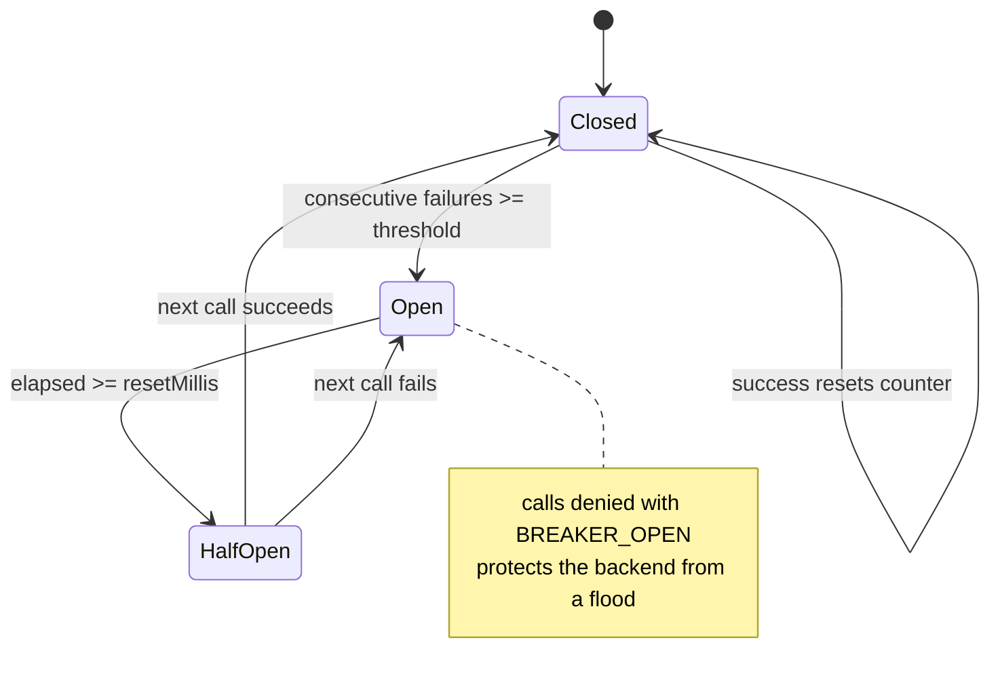
```mermaid
stateDiagram-v2
  [*] --> Closed
  Closed --> Open: consecutive failures >= threshold
  Open --> HalfOpen: elapsed >= resetMillis
  HalfOpen --> Closed: next call succeeds
  HalfOpen --> Open: next call fails
  Closed --> Closed: success resets counter
  note right of Open
    calls denied with BREAKER_OPEN
    protects the backend from a flood
  end note
```

### Implementation notes

Class: `governance.CircuitBreaker(failureThreshold, resetMillis)`.

- Config: `MCP_GW_BREAKER_FAILURES` (default 5), `MCP_GW_BREAKER_RESET_MS` (default 30000).
- State is per tool name.
- `TIMEOUT`, `BACKEND_ERROR`, and executor rejection call `recordFailure`.
- `INVALID_INPUT` does **not** trip the breaker.
- HALF_OPEN admits exactly one probe (`halfOpenInFlight` claim); success -> CLOSED, failure -> OPEN.
- Open tools deny with `BREAKER_OPEN` (step 7) before the backend is touched.

## 13. State machine: approval token lifecycle

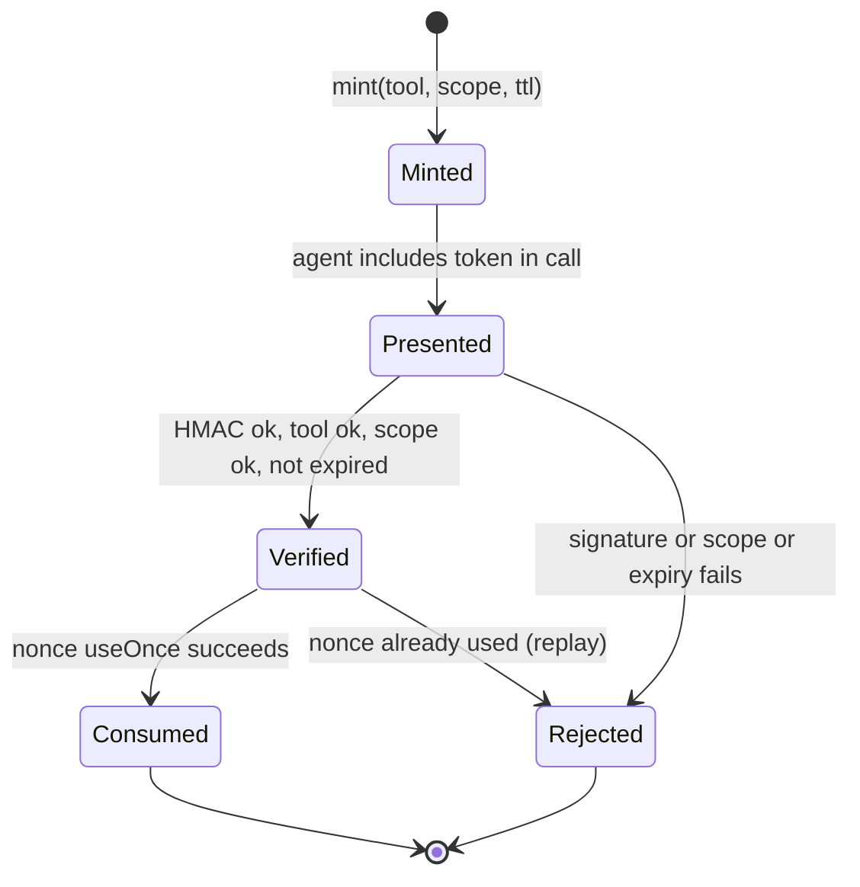
```mermaid
stateDiagram-v2
  [*] --> Minted: mint(tool, scope, ttl)
  Minted --> Presented: agent includes token in call
  Presented --> Verified: HMAC ok, tool ok, scope ok, not expired
  Presented --> Rejected: signature or scope or expiry fails
  Verified --> Consumed: nonce useOnce succeeds
  Verified --> Rejected: nonce already used (replay)
  Consumed --> [*]
  Rejected --> [*]
```

### Implementation notes

Same as section 11. States map to code as:

| State | Code path |
| --- | --- |
| Minted | `Approval.mint(tool, scope, ttlMillis)` |
| Presented | argument `approvalToken` on `tools/call` |
| Verified | HMAC + tool + scope + expiry OK |
| Consumed | `NonceStore.useOnce` first success |
| Rejected | bad sig / wrong tool / wrong scope / expired / replay -> `APPROVAL_REQUIRED` |

Default TTL: `MCP_GW_APPROVAL_TTL_MS` (300000).

## 14. Sequence: VRP data-integrity gate on commit (optional, author-owned)

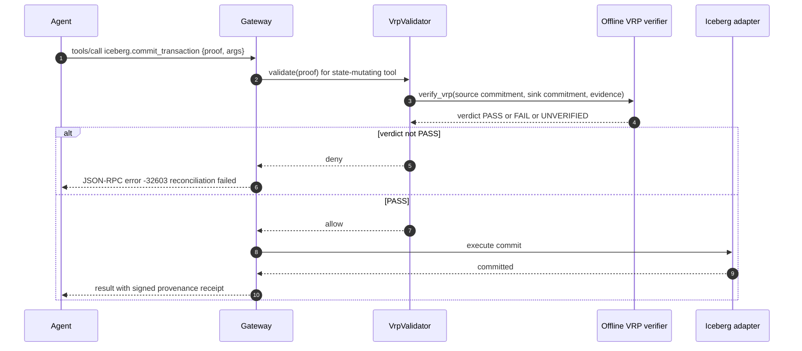
```mermaid
sequenceDiagram
  autonumber
  participant Ag as Agent
  participant GW as Gateway
  participant VRP as VrpValidator
  participant Ver as Offline VRP verifier
  participant Ice as Iceberg adapter
  Ag->>GW: tools/call iceberg.commit_transaction {proof, args}
  GW->>VRP: validate(proof) for state-mutating tool
  VRP->>Ver: verify_vrp(source commitment, sink commitment, evidence)
  Ver-->>VRP: verdict PASS or FAIL or UNVERIFIED
  alt verdict not PASS
    VRP-->>GW: deny
    GW-->>Ag: JSON-RPC error -32603 reconciliation failed
  else PASS
    VRP-->>GW: allow
    GW->>Ice: execute commit
    Ice-->>GW: committed
    GW-->>Ag: result with signed provenance receipt
  end
```

### Implementation notes

Class: `integrity.VrpValidator`. Enabled with `MCP_GW_VRP_ENABLED` (and receipt TTL).

**0.1.0 design in code:** dry-run receipt scheme (compatible with Iceberg maintenance):

1. Destructive (and optionally mutating) call with `dryRun=true` records a receipt bound to
   caller + tool + argument fingerprint.
2. Real run must present that receipt; otherwise `VRP_FAILED` (step 9).
3. Iceberg tools: `expire_snapshots`, `remove_orphan_files`, `rewrite_data_files`, `drop_table`,
   `commit_transaction`, plus READ companion `dry_run_maintenance`.

The offline cryptographic `verify_vrp(source, sink, evidence)` path returning PASS/FAIL/UNVERIFIED
and JSON-RPC `-32603` is author-owned / optional and not yet wired; the receipt gate is what ships
so the pipeline works before an external verifier exists.

## 15. Data model: audit chain, digest registry, token registry

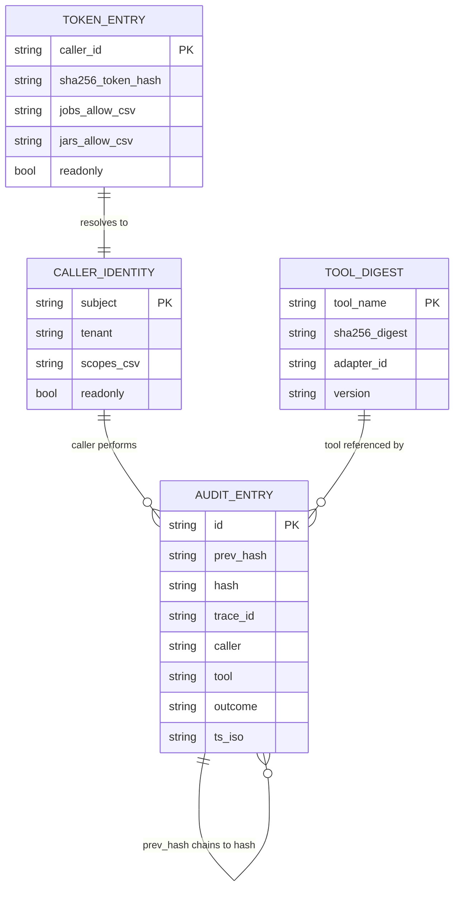
```mermaid
erDiagram
  AUDIT_ENTRY {
    string id PK
    string prev_hash
    string hash
    string trace_id
    string caller
    string tool
    string outcome
    string ts_iso
  }
  TOOL_DIGEST {
    string tool_name PK
    string sha256_digest
    string adapter_id
    string version
  }
  TOKEN_ENTRY {
    string caller_id PK
    string sha256_token_hash
    string jobs_allow_csv
    string jars_allow_csv
    bool   readonly
  }
  CALLER_IDENTITY {
    string subject PK
    string tenant
    string scopes_csv
    bool   readonly
  }
  AUDIT_ENTRY ||--o{ AUDIT_ENTRY : "prev_hash chains to hash"
  CALLER_IDENTITY ||--o{ AUDIT_ENTRY : "caller performs"
  TOKEN_ENTRY ||--|| CALLER_IDENTITY : "resolves to"
  TOOL_DIGEST ||--o{ AUDIT_ENTRY : "tool referenced by"
```

### Implementation notes

**AuditLog** (`observability.AuditLog`): in-memory ring (500). Each entry stores `record`,
`hash`, `prevHash` where `hash = SHA-256(prevHash | record)`. `verifyChain()` validates continuity
from the oldest retained entry. Implements `Observer` so every allow/deny is appended.

**DigestRegistry** / **ToolCatalogIntegrity**: digest over tool name, class, description, and
whitespace-normalized `inputSchemaJson`. First sight pins; later mismatch is a rug-pull error at
aggregation / verify time. Overlay pins from `tools.yaml` are compared too.

**TokenRegistry**: see section 5. Hashes only; never stores raw bearer secrets.

**CallerIdentity**: see section 5. Subject is the audit `caller` field.

## 16. Interceptor directionality

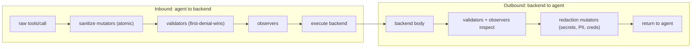
```mermaid
flowchart LR
  subgraph Inbound["Inbound: agent to backend"]
    I0["raw tools/call"] --> IM["sanitize mutators (atomic)"]
    IM --> IV["validators (first-denial-wins)"]
    IV --> IO["observers"]
    IO --> EX["execute backend"]
  end
  subgraph Outbound["Outbound: backend to agent"]
    O0["backend body"] --> OV["validators + observers inspect"]
    OV --> OM["redaction mutators (secrets, PII, creds)"]
    OM --> OR["return to agent"]
  end
  EX --> O0
```

### Implementation notes

Inbound (`InterceptorChain.execute`):

1. `MUTATION`: registered mutators (`ArgumentSanitizeMutator` by default).
2. `VALIDATION`: steps 1-9 in `preflight` (first denial wins).
3. Budget / cache checks.
4. `EXECUTE`: backend on `TimeoutExecutor`.
5. `OBSERVATION`: `Trace`, `Metrics`, `AuditLog`.

Outbound:

1. `OutputControls.bound(body)` truncates to `MCP_GW_MAX_BYTES` with `...<truncated>`.
2. `OutputControls.redact(bounded)` applies DLP patterns.
3. Combined as `boundAndRedact` so a secret cannot sit across the truncation boundary.

Helpers: `runInbound(tool, ctx)` -> preflight Decision; `runOutbound(body)` -> redacted string.

## 17. Sequence: cross-engine anomaly resolution (the payoff)

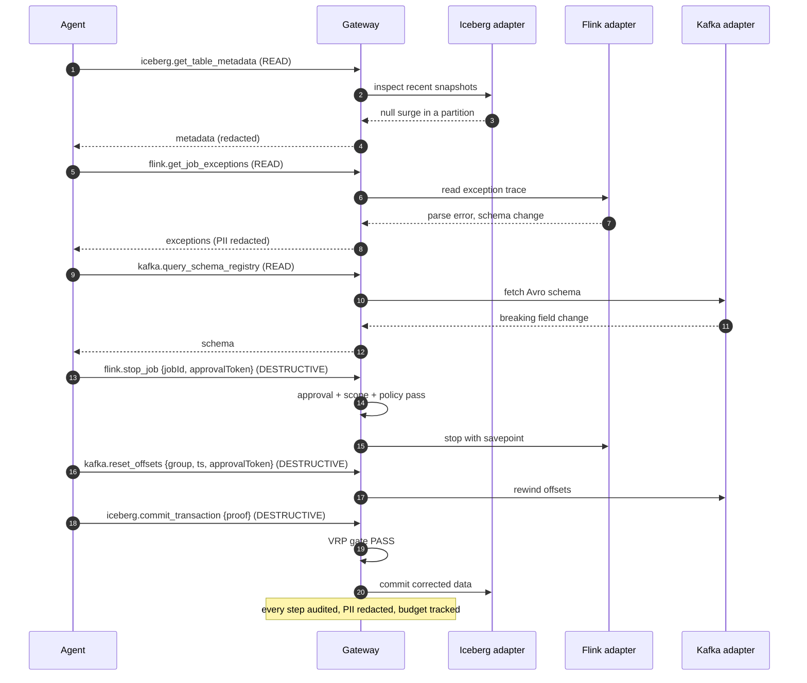
```mermaid
sequenceDiagram
  autonumber
  participant Ag as Agent
  participant GW as Gateway
  participant Ice as Iceberg adapter
  participant Fl as Flink adapter
  participant Ka as Kafka adapter
  Ag->>GW: iceberg.get_table_metadata (READ)
  GW->>Ice: inspect recent snapshots
  Ice-->>GW: null surge in a partition
  GW-->>Ag: metadata (redacted)
  Ag->>GW: flink.get_job_exceptions (READ)
  GW->>Fl: read exception trace
  Fl-->>GW: parse error, schema change
  GW-->>Ag: exceptions (PII redacted)
  Ag->>GW: kafka.query_schema_registry (READ)
  GW->>Ka: fetch Avro schema
  Ka-->>GW: breaking field change
  GW-->>Ag: schema
  Ag->>GW: flink.stop_job {jobId, approvalToken} (DESTRUCTIVE)
  GW->>GW: approval + scope + policy pass
  GW->>Fl: stop with savepoint
  Ag->>GW: kafka.reset_offsets {group, ts, approvalToken} (DESTRUCTIVE)
  GW->>Ka: rewind offsets
  Ag->>GW: iceberg.commit_transaction {proof} (DESTRUCTIVE)
  GW->>GW: VRP gate PASS
  GW->>Ice: commit corrected data
  Note over GW: every step audited, PII redacted, budget tracked
```

### Implementation notes

This is the product narrative across adapters, not a single API. In 0.1.0:

| Step | Tool | Adapter status |
| --- | --- | --- |
| Inspect table metadata | `get_table` / `get_table_metadata` | Iceberg REST client (JDK HTTP); redacts vended credentials |
| Job exceptions | `get_job_exceptions` | Flink REST live |
| Schema registry | `query_schema_registry` | Kafka Schema Registry HTTP client |
| Stop job | `stop_job` + approval | Flink REST live |
| Reset offsets | `reset_offsets` + approval | Kafka AdminClient |
| Commit / maintenance | `commit_transaction` / expire / rewrite + VRP | Iceberg REST commit/drop; engine procedures for expire/rewrite; VRP gate in core |

Every hop still passes the same interceptor chain, audit, and output redaction.

## 18. Deployment: highly available topology

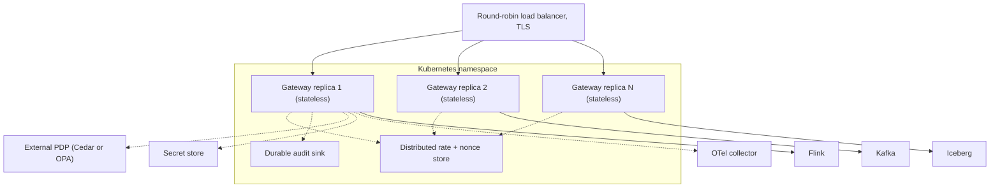
```mermaid
flowchart TB
  LB["Round-robin load balancer, TLS"]
  subgraph K8s["Kubernetes namespace"]
    G1["Gateway replica 1 (stateless)"]
    G2["Gateway replica 2 (stateless)"]
    G3["Gateway replica N (stateless)"]
    Redis["Distributed rate + nonce store"]
    Audit["Durable audit sink"]
  end
  PDP["External PDP (Cedar or OPA)"]
  Vault["Secret store"]
  OTELC["OTel collector"]
  LB --> G1
  LB --> G2
  LB --> G3
  G1 -.-> Redis
  G2 -.-> Redis
  G3 -.-> Redis
  G1 -.-> Audit
  G1 -.-> PDP
  G1 -.-> Vault
  G1 -.-> OTELC
  G1 --> Flink["Flink"]
  G2 --> Kafka["Kafka"]
  G3 --> Iceberg["Iceberg"]
```

Notes: replicas are stateless (enabled by the 2026-07-28 core), so scaling is horizontal
with no sticky sessions. Shared state (rate counters, nonces, audit) is externalized.
Each adapter can also run as its own deployment for blast-radius isolation.

### Implementation notes

Shipped packaging:

- Runnable: `mcp-gateway-dist/target/aegis-mcp-gateway-0.1.0-all.jar`
- Docker: `mcp-gateway-dist/src/main/docker/Dockerfile` (Temurin 17 JRE)
- Helm: `mcp-gateway-dist/src/main/helm/aegis-mcp-gateway/`

**0.1.0 process state is in-memory:** `RateLimiter`, `NonceStore`, `AuditLog`, `SemanticCache`.
Horizontal replicas do not yet share rate or nonce state. LLD Redis / durable audit boxes are the
target HA topology; wire them before multi-replica approval replay protection is required.

Replicas are otherwise stateless MCP servers (stdio or HTTP). Prefer TLS and `tokenfile` or
future OAuth at the edge. Ops probes: `/healthz`, `/readyz` (fails after `markNotLive`),
`/metrics` (Prometheus). Auth filter applies only to `/mcp/*`.

## 19. Threading and concurrency model

```mermaid
flowchart LR
  Req["Request thread (servlet)"] -->|auth, validators run here| Chk["Validation phase"]
  Chk -->|submit backendCall| Pool["Per-adapter bounded ThreadPoolExecutor"]
  Pool -->|future.get(timeout)| Res["Result or TIMEOUT"]
  Res --> Req
```

- Validators (auth, scope, policy, approval, egress, rate, breaker, prompt-injection) run
  on the request thread, so CallerContext (ThreadLocal) is valid at check time, before
  any pool handoff.
- Backend execution runs on a bounded per-adapter pool (core 4, max 32, queue 128,
  daemon threads, abort policy) so a slow backend cannot exhaust the gateway.
- `future.get(toolTimeoutMillis)` enforces the per-tool deadline; on timeout the future
  is cancelled and the breaker records a failure. Timeout is a response deadline, not a
  cancellation guarantee for the underlying REST call.
- Shutdown hook drains pools and the HTTP server within the configured budget.

### Implementation notes

Class: `governance.TimeoutExecutor`.

| Setting | Value |
| --- | --- |
| Core pool | 4 |
| Max pool | 32 |
| Queue | 128 (`LinkedBlockingQueue`) |
| Threads | daemon, named `aegis-backend-*` |
| Rejection | `AbortPolicy` -> `BACKEND_ERROR` |
| Deadline | `future.get(MCP_GW_TOOL_TIMEOUT_MS)` (default 30000, min 50) |

Validators run on the request/MCP handler thread so `CallerContext` is visible. The pool
propagates `CallerContext` onto worker threads and clears it in `finally`.

Note: 0.1.0 uses one process-wide pool. LLD "per-adapter pool" isolation is a follow-up so one
slow engine cannot fill the shared queue.

## 20. Denial and error code catalog

| Code | Step | Meaning | Breaker impact |
|---|---|---|---|
| NOT_EXPOSED | 1 | tool not registered or not allowed for caller | none |
| READONLY_CALLER | 2 | non-read tool for a readonly caller | none |
| SCOPE_DENIED | 2 | target job, jar, or namespace not in caller allowlist | none |
| POLICY_DENIED | 3 | PDP returned deny | none |
| APPROVAL_REQUIRED | 4 | missing, expired, replayed, or wrong-scope token | none |
| EGRESS_DENIED | 5 | target host not allowlisted or link-local/metadata | none |
| RATE_LIMITED | 6 | per-caller bucket exhausted | none |
| BREAKER_OPEN | 7 | per-tool breaker open | none |
| PROMPT_INJECTION | 8 | adversarial payload detected | none |
| VRP_FAILED | 9 | reconciliation proof not PASS (state-mutating) | none |
| INVALID_INPUT | 10 | argument or SQL validation failed | no trip |
| TIMEOUT | 10 | backend exceeded per-tool deadline | trip |
| BACKEND_ERROR | 10 | backend call failed | trip |

### Implementation notes

Constants live on `interceptor.Decision` (`NOT_EXPOSED`, ... `BUDGET_EXCEEDED`). Steps are
`STEP_EXPOSURE=1` ... `STEP_EXECUTE=10`.

| Code | Step | Implemented by |
| --- | --- | --- |
| NOT_EXPOSED | 1 | `Exposure` |
| READONLY_CALLER | 2 | chain + `CallerIdentity.readonly` / `MCP_GW_READONLY_CALLER` |
| SCOPE_DENIED | 2 | `Scope` + `jobAllowed` / `jarAllowed` / `scopeAllowed` |
| POLICY_DENIED | 3 | `PolicyDecisionPoint` |
| APPROVAL_REQUIRED | 4 | `Approval` |
| EGRESS_DENIED | 5 | `EgressGuard` (metadata IPs always denied) |
| RATE_LIMITED | 6 | `RateLimiter.allow(callerId)` |
| BREAKER_OPEN | 7 | `CircuitBreaker` |
| PROMPT_INJECTION | 8 | `PromptInjectionGuard` |
| VRP_FAILED | 9 | `VrpValidator` |
| INVALID_INPUT | 10 | `Inputs.InvalidInput` (no breaker trip) |
| TIMEOUT | 10 | `TimeoutException` (trips breaker) |
| BACKEND_ERROR | 10 | other backend failures / reject (trips breaker) |
| BUDGET_EXCEEDED | FinOps | `TokenBudget` (pre/post execute) |

## 21. Key configuration surface (low level)

| Env key | Default | Purpose |
|---|---|---|
| MCP_GW_TRANSPORT | stdio | stdio or http |
| MCP_GW_HTTP_HOST | 127.0.0.1 | bind host |
| MCP_GW_HTTP_TLS_ENABLED | false | require keystore + password when true |
| MCP_GW_AUTH_MODE | tokenfile | oauth, cimd, spiffe, tokenfile |
| MCP_GW_OAUTH_ISSUER / _AUDIENCE / _JWKS_URL | none | OAuth RS validation |
| MCP_GW_SPIFFE_TRUST_DOMAIN / _SOCKET | none | SPIFFE mTLS |
| MCP_GW_PDP | builtin | builtin, cedar, opa |
| MCP_GW_WRITE_ENABLED | false | master switch for mutate/destructive |
| MCP_GW_APPROVAL_SECRET | none | required when writes enabled |
| MCP_GW_RPS | 5 | per-caller rate |
| MCP_GW_TOOL_TIMEOUT_MS | 30000 | per-tool deadline (>=50) |
| MCP_GW_MAX_BYTES | 65536 | output bound (>=256) |
| MCP_GW_MAX_SQL_CHARS | 32768 | SQL length bound |
| MCP_GW_EGRESS_ALLOW_HOSTS | none | SSRF allowlist |
| MCP_GW_TOKEN_BUDGET_DAILY | none | FinOps cap |
| MCP_GW_ADAPTERS | none | comma list of enabled adapters |

Fail-fast: `validate()` rejects bad URLs, unknown transport or auth mode, writes without
a secret, http without auth, TLS without keystore, and out-of-range limits.

### Implementation notes

`GatewayConfig.fromEnv()` layers optional YAML (`MCP_GW_CONFIG` / `gateway-default.yaml`) under
environment overrides. Extra keys used in code beyond the table above:

| Env key | Purpose |
| --- | --- |
| MCP_GW_HTTP_PORT | bind port (default 8090) |
| MCP_GW_HTTP_BEARER_TOKEN | single-token HTTP auth |
| MCP_GW_AUTH_TOKENS_FILE | multi-caller hashed token registry |
| MCP_GW_HTTP_TLS_KEYSTORE / _PASSWORD / _TYPE | TLS material |
| MCP_GW_APPROVAL_TTL_MS | approval lifetime |
| MCP_GW_BREAKER_FAILURES / _RESET_MS | breaker |
| MCP_GW_DLP_ENABLED | output redaction toggle |
| MCP_GW_PROMPT_INJECTION_ENABLED | injection guard toggle |
| MCP_GW_VRP_ENABLED / _RECEIPT_TTL_MS | VRP gate |
| MCP_GW_SEMANTIC_CACHE_TTL_MS | READ cache |
| MCP_GW_TOOLS_ALLOWED | CSV allow list (default read profile) |
| MCP_GW_READONLY_CALLER | force readonly |
| MCP_GW_POLICY_FILE | builtin PDP rules |
| MCP_GW_LOG_LEVEL | Logback root level |
| MCP_GW_SHUTDOWN_TIMEOUT_MS | drain budget |
| FLINK_REST_URL / MCP_FLINK_* / SPARK_* / ICEBERG_* / kafka bootstrap | adapter endpoints via `adapterProperty` |

`validate()` rejects unknown transport/auth/pdp, writes without secret, HTTP without inbound auth
config, TLS without keystore+password, out-of-range limits, and non-http(s) OAuth/CIMD URLs.

## 22. Per-adapter endpoint map (low level)

Flink (taxonomyClass streaming):

| Tool | Class | Backend call |
|---|---|---|
| list_jobs | READ | GET /jobs/overview |
| get_job | READ | GET /jobs/{id} |
| get_job_exceptions | READ | GET /jobs/{id}/exceptions |
| run_sql_readonly | READ | SQL Gateway execute, SqlReadonlyGuard |
| trigger_savepoint | MUTATE | POST /jobs/{id}/savepoints |
| rescale_job | MUTATE | PATCH /jobs/{id}/rescaling?parallelism=N |
| stop_job | DESTRUCTIVE | POST /jobs/{id}/stop |
| cancel_job | DESTRUCTIVE | PATCH /jobs/{id} mode=cancel |
| run_sql_ddl_dml | DESTRUCTIVE | SQL Gateway execute |

Kafka (messaging): describe_topic, query_schema_registry, inspect_dlq (READ);
reset_offsets, delete_records (DESTRUCTIVE); create_topic, alter_config (MUTATE).

Spark (batch): History Server reads; Spark Connect guarded SQL; Livy submit_batch and
kill_application (DESTRUCTIVE).

Iceberg (lakehouse): list and get reads; create and alter (MUTATE); drop, expire_snapshots,
remove_orphan_files, rewrite_data_files (DESTRUCTIVE, VRP-gated, dry-run companion).

### Implementation notes

#### Flink (`mcp-adapter-flink`, taxonomy `streaming`)

Manifest: `adapters/flink/tools.yaml`. Factory: `FlinkToolFactory`. Clients: `FlinkRestClient`,
`SqlGatewayClient`, `SqlReadonlyGuard`, `OutboundAuth`.

Full READ set also includes `get_job_status`, `get_job_metrics`, `list_checkpoints`, `list_jars`,
`get_cluster_info`, `list_taskmanagers`, `get_job_config`, `get_flink_config`. MUTATE also
`upload_jar`. DESTRUCTIVE also `run_jar`.

#### Kafka (`mcp-adapter-kafka`, taxonomy `messaging`)

Live `AdminClient` (`KafkaAdminSupport`), Schema Registry HTTP (`SchemaRegistryClient`), and DLQ
inspect path. Identifiers validated with `Inputs.requireTopic` / `requireId`. Broker timeouts
propagate so the circuit breaker can open.

#### Spark (`mcp-adapter-spark`, taxonomy `batch`)

`SparkHttpClient` for History Server, Livy (`POST`/`DELETE` batches), and optional SQL HTTP.
`run_sql_readonly` uses core `SqlReadonlyGuard` and requires `SPARK_SQL_HTTP_URL`. History/Livy
HTTP failures propagate (breaker-visible).

#### Iceberg (`mcp-adapter-iceberg`, taxonomy `lakehouse`)

`IcebergRestClient` supports GET/POST/DELETE and redacts credential/token/access-key fields.
Tools include `commit_transaction`, `get_table_metadata` (alias), maintenance DESTRUCTIVE set, and
`dry_run_maintenance`. Snapshot expire / orphan remove / rewrite require an engine procedure and
fail closed unless `dryRun=true`.

## 23. Notes for reviewers

- Every diagram maps to a section of `DESIGN-apache-mcp-gateway.md`; this doc is the
  low-level view, not a second source of truth.
- Author-owned components (VRP and PVDM, KIP-1318, mcp-bastion, agent-skills,
  mcp-test-harness) appear as optional, pluggable elements and are labeled as such.
- Draft standards (SEP-1763 interceptors, CIMD, digest-pinning SEP) are drawn to their
  shape; the pipeline runs without them so the gateway ships before they ratify.
- The Flink adapter column reflects the already-built and validated v0.3.0 server.

### Implementation status summary (0.1.0)

| Area | Status |
| --- | --- |
| Interceptor chain steps 1-10 + deny codes | Implemented and tested |
| Flink adapter + embedded HTTP fakes | Implemented |
| Kafka / Spark / Iceberg adapters + YAML | Live Admin/History/Livy/REST; Iceberg engine maintenance procedures still external |
| Builtin PDP, approvals, breaker, egress, DLP | Implemented |
| OAuth JWKS | Implemented; CIMD / SPIFFE refuse-start → [ROADMAP](../ROADMAP.md) 0.3 |
| Cedar-lite / OPA HTTP evaluation | Implemented (fail-closed); full Cedar runtime → ROADMAP 0.3 |
| OpenTelemetry SDK GenAI spans | Structured `gen_ai.*` logs shipped; OTel SDK bridge → ROADMAP 0.2 |
| Redis shared rate/nonce / audit seal | Not shipped → ROADMAP 0.2 |
| Shade jar / Docker / Helm | Shipped under `mcp-gateway-dist` |

All other design differences: [ROADMAP.md](../ROADMAP.md).

Strategic context, MCP 2026-07-28 / interceptor SEP mapping, Bastion compose notes, and Kafka
KIP roadmap implications: see
[RESEARCH-centralized-mcp-gateway.md](RESEARCH-centralized-mcp-gateway.md).

Build: `mvn clean verify`. Run:

```bash
MCP_GW_ADAPTERS=flink FLINK_REST_URL=http://localhost:8081 \
  java -jar mcp-gateway-dist/target/aegis-mcp-gateway-0.1.0-all.jar
```
