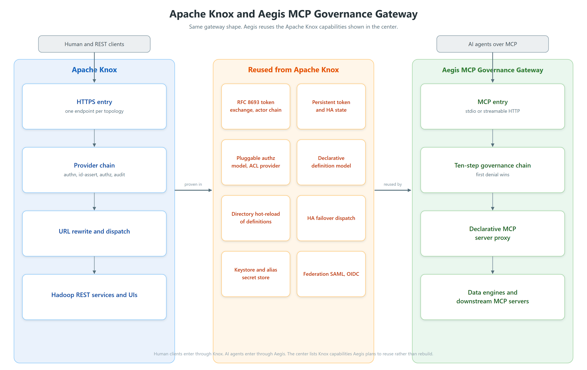

# Aegis and Apache Knox: mapping, reuse, and a phased plan

Author: Viquar Khan

Status: working note for incubator / Knox coordination (dev-list discussion with Larry McCay).
Not a second source of truth for SPI or deny codes; those remain in code and
[DESIGN-CONFORMANCE-0.1.md](DESIGN-CONFORMANCE-0.1.md). Where this note reshapes timing versus
[ROADMAP.md](../ROADMAP.md), treat the note as proposed direction until the roadmap is updated.

This is my working note for the incubator discussion with Larry and the wider dev list. I wanted
one place that shows how the Aegis governance chain lines up with the Knox provider chain, what we
should reuse from Knox instead of rebuilding, and how the plan changes now that we have agreed to
lead with a declarative, config-driven proxy.

The short version is that both projects are the same shape. A caller hits a single entry point, the
request runs through an ordered chain of policy enforcers, then it reaches a backend, and everything
is written to an audit trail. Knox has been doing this for human and REST clients in front of Hadoop
for years. Aegis does it for AI agents talking to data engines over MCP. Because the shape is the
same, a lot of what Knox already solved is work I would rather inherit than repeat.

## How the two projects relate

The picture reads left to right. Human and REST clients go through Knox. AI agents go through
Aegis. The middle column is the set of capabilities Knox has already built and hardened that Aegis
plans to reuse rather than write from scratch. The rendered diagram is
[assets/aegis-knox-relationship.png](assets/aegis-knox-relationship.png).

## Design direction from the dev-list discussion

This section summarizes the direction that came out of the dev-list discussion, in particular Larry
McCay's review of the repository, and where we landed together. Larry's feedback has been the most
useful the project has had, and it reshaped the plan in a good way. It is the consensus that frames
the rest of the note.

### The starting point

Larry's review observed that the first cut of Aegis looked like one large MCP server, with a
separate hand-written set of tools for each data engine built into the project, and it flagged two
real problems with that shape.

1. It does not scale. Keeping a hand-written adapter current with every engine's API across many
   release trains is a treadmill, and I already feel it.
2. It duplicates effort. The moment an engine ships its own MCP server, the adapter for it turns
   into something to compete with and track.

The suggestion was to concentrate on the governance and security value, the traditional gateway job,
and stop carrying bespoke per-engine integration. That is the right call, and the points below are
where we landed.

### 1. Lead with a config-driven MCP server proxy

Larry suggested discovering and integrating MCP servers over the MCP protocol itself, driven by
configuration rather than code. This is now the lead. We pull the thin adapters out and put a
declarative, config-driven proxy in front of downstream MCP servers, so adding a server becomes a
definition file rather than a new Maven module. It is the same move Knox made when it went from
writing code for every new service to a declarative service definition model.

### 2. A break-glass path and mashup servers

Larry suggested a way to stand up a server where none exists, and possibly to combine several
servers into one. Agreed, with one thing I would like to keep. The four deep adapters (Flink,
Kafka, Spark, Iceberg) stay, and not only as a break-glass fallback. They are the reference bar for
what real governance looks like when the gateway understands the tool, and the proxy path should be
measured against that bar. Break-glass and mashup definitions sit on the same declarative model. I
would also keep the data platform as the proving ground, because the hardest cases live there, such
as destructive schema changes, bulk data leaving the building, and personal data in a query result.
If the design holds against those, it holds elsewhere.

### 3. OAuth discovery and delegated agentic identity

Larry pointed at Knox's RFC 8693 token exchange with an actor chain, which keeps the record of who
is acting on behalf of whom through the whole call. This is the 0.2 credential work. Today Aegis
forwards the caller's `Authorization` header via `PassThroughCredentialResolver`, which is the
classic confused deputy and is what the MCP spec advises against. Proxying and identity are really
one design. A gateway that discovers a server and forwards a token is unsafe until identity is
re-minted at the boundary, and that re-minting is exactly what Knox already does, so building on it
makes more sense than working alongside it.

### 4. Authorization at the tool and resource level

Larry suggested fine-grained access at the tool and resource level rather than the server level,
with Apache Ranger as an authorization provider. Aegis already decides per tool call, so this fits
the way the chain works rather than needing a rebuild. The plan is to consult Ranger as the policy
decision point, so agent access honors the organization's live data-access policies instead of a
second, parallel set. Today the Ranger module is still a thin adapter (engine as tool target); the
PDP flip is the work item, not something already shipped.

### 5. An MCP server catalog

Larry suggested a user-facing catalog for discovery, with an API and a UI. It sits comfortably on
top of the declarative model and the authorization decisions, and it can follow the patterns Knox
already has in its admin API, admin UI, and homepage.

## Where we saw it differently, and how we reconciled it

Early on, the open question was whether proxying MCP servers could be most of the story. My concern
is that a pure proxy governs the envelope and not the action. Deciding that a call is read-only,
that a result needs redacting, or that an operation is destructive and needs approval all require
some understanding of the tool, not just its bytes. MCP tool hints exist, but they come from the
very server we are trying to govern, so the safe design treats them as claims to verify rather than
facts to trust. Tool poisoning and rug pulls live in those protocol responses and slip past static
checks, and the layer that catches them is one that pins each tool and rejects it the moment its
definition changes.

We reconciled this cleanly. The governance context goes into the declarative MCP server definition,
so the proxy is not blind. That definition carries the per-tool class, scope, egress, redaction, and
a pinned schema digest. With it, proxy-first and understand-the-tool stop being in tension, and that
is the centerpiece of the direction.

0.1.0 already pins digests for registered tools (`ToolCatalogIntegrity` / `DigestRegistry`, optional
`MCP_GW_TOOLS_CATALOG` and `MCP_GW_CATALOG_FAIL_CLOSED`). Extending that to discovered proxied tools
is the 0.2 integrity work, not a green field.

## A coordination point

Larry noted that 16 of the 33 engines in the list already have Knox service definitions, including
all four deep ones. That argues for coordinating on a shared identity and authorization layer, and
on the shape of the declarative definition, before the SPI hardens, so the projects reuse rather
than run parallel schemas. (The "16 of 33" figure is from Larry's review; it is not re-counted in
this repository.)

## How the chains line up

Knox assembles its chain per topology from declarative service definitions. The usual default policy
order is webappsec, authentication, rewrite, identity-assertion, authorization, dispatch (see Knox
service-definition defaults / `ServiceDefinitionDeploymentContributor`). Aegis runs a fixed ten-step
chain where the first denial wins and returns a stable code (see `InterceptorChain.preflight` and
`Decision`).

Authentication sits outside the numbered Aegis tool chain (HTTP filter / stdio default caller).
Audit runs after execute. Both are shown in the table for the Knox mapping.

| Step | Aegis step and deny code | Knox provider role | Notes |
| --- | --- | --- | --- |
| before 1 | Authentication | authentication and federation | Knox uses Shiro and LDAP, KnoxSSO, pac4j, and HeaderPreAuth. Aegis uses bearer, token file, and OAuth with JWKS. `MCP_GW_AUTH_MODE=cimd` and `spiffe` are defined but refuse to start today (`GatewayBootstrap.buildAuthFilter`). |
| 1 | Exposure, `NOT_EXPOSED` | none | Aegis only registers tools it will honor, so write-locked tools are never advertised. Knox exposes every route a topology declares. |
| 2 | Scope, `READONLY_CALLER` and `SCOPE_DENIED` | identity-assertion (analogue) | Knox maps a caller to an effective principal and groups. Aegis maps a caller to scopes and resource allow lists such as job, jar, topic, and table. Closest role, not a line-for-line copy. |
| 3 | Policy, `POLICY_DENIED` | authorization | Knox uses an ACL provider by user, group, and IP. Aegis uses a PDP that can be builtin, OPA, or cedar-lite / HTTP delegate. Ranger is a suggested PDP backend for this step. |
| 4 | Approval, `APPROVAL_REQUIRED` | none | Aegis needs a single-use HMAC approval token for anything that is not read-only. Knox has no per-request approval gate. |
| 5 | Egress and SSRF, `EGRESS_DENIED` | dispatch whitelist | Knox restricts dispatch targets for configured service roles with a whitelist (`WhitelistUtils`). Aegis uses an allow list plus an unconditional deny of metadata and link-local ranges (`EgressGuard` / `EgressConnect`). |
| 6 | Rate limit, `RATE_LIMITED` | none | First class in Aegis, usually external infrastructure in a Knox deployment. |
| 7 | Circuit breaker, `BREAKER_OPEN` | none | First class in Aegis. |
| 8 | Prompt injection scan, `PROMPT_INJECTION` | none | Inbound tripwire (and outbound scan on results). No Knox analogue, because Knox has no model in the loop. |
| 9 | VRP receipt, `VRP_FAILED` | none | Dry-run receipt for destructive operations (optional HMAC `vrp1.` when signing is configured). No Knox analogue. |
| none | none | rewrite, inbound and outbound URL | Knox rewrites URLs to hide cluster internals. Aegis exposes typed tools, so there is nothing to rewrite. |
| 10 | Execute and output controls | dispatch | Knox forwards through the dispatch filter (`DefaultDispatch`), and the rewrite provider rewrites the response. Aegis runs the backend, then bounds and redacts output and scans it again. Deny codes at this step also include `INVALID_INPUT`, `TIMEOUT`, `BACKEND_ERROR`, and `BUDGET_EXCEEDED`. |
| after 10 | Audit, hash chained | audit | Knox uses a Log4j audit context. Aegis uses a SHA-256 hash chain that is tamper-evident, optionally durable via `MCP_GW_AUDIT_FILE`, exposed at `/audit/verify`. |

Reading the table, steps 2, 3, 5, authentication, execute, and audit have direct Knox analogues.
Steps 1, 4, 6, 7, 8, and 9 are the additions the agent era needs. The rewrite role is Knox only.

## What else we inherit from Knox

My earlier note listed three things to reuse. Looking harder at the Knox codebase, there is more,
and it is worth being explicit so we do not accidentally rebuild it. Here is the fuller list.

1. **Delegated identity, RFC 8693 token exchange with an actor chain.** Knox carries the
   delegation record in the JWT `act` claim (see `TokenExchangePrincipal` and
   `ActorChainPrincipal`). This replaces the per-caller pass-through and preserves who is acting on
   behalf of whom end to end. It is also the prerequisite that makes proxying safe.
2. **Externalized high-availability state.** Knox has a server-managed `TokenStateService`, with a
   `PersistentTokenStateService` that can be backed by a database, ZooKeeper, or the file system.
   Aegis keeps its nonce store, rate limiter, token budget, and in-process audit chain in memory
   today, so this is the piece that lets Aegis run more than one replica correctly.
   [ROADMAP.md](../ROADMAP.md) currently names Redis (or equivalent) for milestone 0.2; Knox-style
   JDBC / ZK / FS persistence is the inheritance target to evaluate against that ADR, not a claim
   that JDBC is already chosen in code.
3. **The pluggable authorization model.** This is alignment rather than inheritance, so I want to
   be precise. Knox authorizes through a pluggable provider, with an ACL provider by user, group,
   and IP in the tree. Aegis already has its own pluggable PDP (builtin, OPA, and cedar-lite), so
   the model matches without copying code. Apache Ranger, which Larry suggested, is not a Knox
   module. In the Hadoop ecosystem Ranger authorizes Knox through a Ranger-side plugin, so for
   Aegis the plan is to consult Ranger as the policy decision point at step 3.
4. **The declarative definition model.** Knox moved from code per service to a declarative service
   definition. Aegis follows the same path for MCP server definitions, which is the centerpiece of
   the new direction.
5. **Directory hot-reload of definitions.** Knox watches its topologies directory and redeploys on
   change without a restart (`DefaultTopologyService`). Aegis can watch a directory of server
   definitions and reload them the same way, including validating a definition before it goes live.
6. **High-availability failover dispatch.** Knox has a failover dispatch that spreads and retries
   across backend replicas (`ConfigurableHADispatch`; the older `DefaultHaDispatch` is deprecated).
   The Aegis proxy can reuse that pattern to fail over across replicas of a downstream MCP server.
7. **Keystore and alias secret store.** Knox has a mature master secret, keystore, and alias
   service. Aegis secrets are environment-only today, so this is the natural foundation for the
   vault-backed credential item already on the roadmap.
8. **Federation with SAML and OIDC.** Knox's pac4j-based federation covers enterprise identity
   providers. The Aegis OAuth resource-server mode can grow into this rather than reinventing it.
9. **Service and endpoint discovery patterns.** Knox discovers cluster layout from Ambari and
   Cloudera Manager through monitors. The same pattern maps onto discovering MCP servers for the
   catalog.
10. **Admin API, admin UI, and homepage.** These are the patterns to build the MCP server catalog
    API and UI on, rather than starting the operator surface from nothing.
11. **Configuration injection and topology validation.** Knox has a small config injection
    framework and validates a topology before deploying it. Both map onto validating a declarative
    server definition and wiring its settings in a fail-closed way.

## The plan, divided into phases

This is how the direction reshapes the roadmap that ships with the code. Nothing here contradicts a
capability that is already done in 0.1.0. It reshapes what comes next and folds the Knox reuse into
each phase.

### Bootstrap

- Complete IP clearance, run the name search, stand up ASF infrastructure, and grow the committer
  base. This stays the top community priority.
- Pull the 29 thin adapters out of the initial contribution and keep the four deep adapters as the
  governance reference bar. (Today the tree has 33 adapter modules: 4 deep + 29 thin HTTP adapters.)
- Draft the declarative MCP server definition schema and coordinate it, and the SPI, with the Knox
  community given the 16-engine overlap Larry noted.
- **Interim multi-replica honesty (ops today, stronger gate proposed):**
  [operations.md](operations.md) already documents that approval nonces, rate limits, and breakers
  are per process, and that the honest defaults are single replica, sticky routing, or writes
  disabled. There is **not** yet a `MCP_GW_REPLICAS` fail-closed startup check in code. A useful
  interim control would refuse to start with more than one replica while writes are unlocked,
  because in-memory single-use approval nonces cannot prevent replay across replicas. Until that
  lands, treat the operations guidance as mandatory, not optional.

### Phase 0.2, identity, high availability, and the proxy foundation

- Build the MCP server proxy and the declarative definition model, including directory hot-reload
  and definition validation. Reuse from Knox: the declarative model, hot-reload, and validation.
- Extend tool catalog integrity to discovered tools, so every proxied tool is pinned and
  re-verified on each `tools/list`, and server hints are verified rather than trusted.
- Replace credential pass-through with RFC 8693 token exchange and an actor chain. Reuse from Knox:
  the token exchange implementation.
- Externalize the shared state (nonce, rate, budget, audit) behind a shared store. Reuse from Knox:
  the persistence layer patterns; reconcile with the Redis-or-equivalent item already on ROADMAP
  0.2. This lifts the single-replica limit.
- Add OAuth discovery to pair with the token exchange work.
- Close the residual DNS-rebinding gap in `EgressConnect` with post-resolve IP pinning where the
  JDK allows it (ROADMAP already lists this as optional 0.2 work; today the URI stays in hostname
  form after resolve-and-deny).
- Lay the groundwork for a keystore and alias secret store, which feeds vault-backed credentials.
  Reuse from Knox: the keystore and alias service.

### Phase 0.3, authorization depth, federation, and resilience

- Wire Apache Ranger in as the policy decision point for tool- and resource-level authorization.
  Ranger is not a Knox module. Larry suggested it, and the integration lives on the Ranger side, so
  this is alignment with the ecosystem rather than reuse of Knox code. Note: the shipped
  [ROADMAP.md](../ROADMAP.md) still lists Ranger under milestone 0.4; this note proposes pulling it
  forward into 0.3 once the proxy and identity foundation land.
- Add federation for enterprise SAML and OIDC identity providers. Reuse from Knox: pac4j-based
  federation.
- Add failover dispatch across downstream MCP server replicas. Reuse from Knox: the HA dispatch.
- Add break-glass and mashup server definitions on the same declarative model.
- Continue the existing 0.3 items: a full Cedar runtime, CIMD and SPIFFE identity, the VRP
  cryptographic proof, MCP Tasks, and semantic caching.

### Phase 0.4 and later, ecosystem and operator experience

- Build the MCP server catalog API and UI. Reuse from Knox: the admin API, admin UI, and homepage
  patterns.
- Continue the ecosystem items already planned: Atlas lineage, engine-aware impact preview, dual
  control approval, purpose binding, compliance mappings, signed catalogs, and a human-in-the-loop
  approval console.
- Candidate engines such as Kyuubi, Polaris, Gravitino, DolphinScheduler, SeaTunnel, InLong,
  Zeppelin, and StreamPark arrive as declarative definitions or proxied servers, not new modules.

## What gets dropped or changes shape

Deepening the 29 thin adapters is largely dropped. Reach comes from the proxy and declarative
definitions, or from the engine's own MCP server, rather than hand-written Java per engine.

## What stays the same

The governance chain, the deny taxonomy, the write lock, and the SPI seams stay stable across all of
this. Filling a deferred item replaces a fail-closed stub behind the same config keys; it does not
redesign the gateway.

## Closing

Both projects are the same architecture: a single entry point, an ordered chain, a backend, and an
audit trail. Aegis reuses the Knox mechanisms for identity, shared state, authorization alignment,
the declarative model, hot-reload, failover, secrets, and federation, and it adds the write lock,
approval, egress for agents, prompt and VRP checks, and tool integrity that governing AI agents
needs. The new direction reshapes the roadmap around a declarative, config-driven proxy while
keeping the four deep adapters as the reference bar for real, tool-aware governance.
